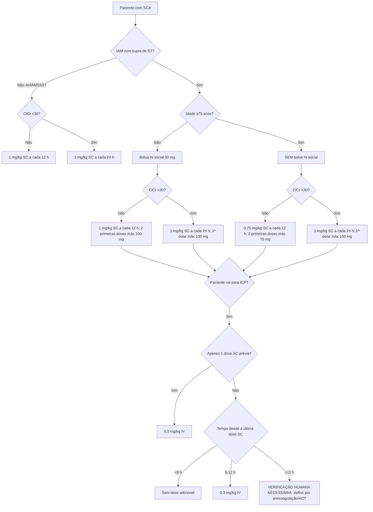

# Enoxaparina na SCA — árvore de dose

O regime de enoxaparina no IAM com supra não pode ser resumido a “1 mg/kg 12/12 h”. A dose muda com **idade, clearance de creatinina e momento da ICP**.

## Angina instável / IAM sem supra

- **1 mg/kg SC a cada 12 horas**.
- ClCr <30 mL/min: **1 mg/kg SC a cada 24 horas**.

## IAM com supra — idade <75 anos

### ClCr ≥30 mL/min
- bolus IV inicial **30 mg**;
- seguido de **1 mg/kg SC**;
- depois 1 mg/kg SC a cada 12 h;
- máximo **100 mg** em cada uma das duas primeiras doses SC.

### ClCr <30 mL/min
- bolus IV inicial **30 mg**;
- 1 mg/kg SC;
- depois 1 mg/kg SC **a cada 24 h**;
- primeira dose SC máximo **100 mg**.

## IAM com supra — idade ≥75 anos

- **Não administrar o bolus IV inicial de 30 mg.**

### ClCr ≥30 mL/min
- **0,75 mg/kg SC a cada 12 h**;
- máximo **75 mg** em cada uma das duas primeiras doses.

### ClCr <30 mL/min
- **1 mg/kg SC a cada 24 h**;
- primeira dose SC máximo **100 mg**.

## Dose adicional para suporte da ICP

A Tabela 10 da ACC/AHA 2025 torna a janela mais precisa que a bula histórica usada na primeira versão desta calculadora:

- última dose SC há **<8 h**: **sem dose adicional**;
- última dose SC há **8–12 h**: **0,3 mg/kg IV**;
- se **apenas uma dose SC de enoxaparina foi administrada**, usar **0,3 mg/kg IV** para suporte da PCI;
- se transcorreram **>12 h** após múltiplas doses prévias, a tabela consultada não fornece um único bolus automático. A calculadora retorna `VERIFICAÇÃO HUMANA NECESSÁRIA` para que anticoagulação prévia e ACT sejam integrados em vez de extrapolar a regra.

## Segurança

A calculadora não substitui avaliação de sangramento, HIT/trombocitopenia, anestesia neuraxial, peso extremo, função renal instável ou estratégia de reperfusão. Em ClCr 30–50 mL/min a bula brasileira consultada não determina redução da dose, mas recomenda monitorização clínica cuidadosa.

## Fontes

- Clexane® (enoxaparina sódica), Sanofi Medley Farmacêutica Ltda., MS 1.8326.0336, IB100619.
- Rao SV, O'Donoghue ML, Ruel M, et al. 2025 ACC/AHA/ACEP/NAEMSP/SCAI Guideline for the Management of Patients With Acute Coronary Syndromes. J Am Coll Cardiol. 2025. DOI **10.1016/j.jacc.2024.11.009**.
