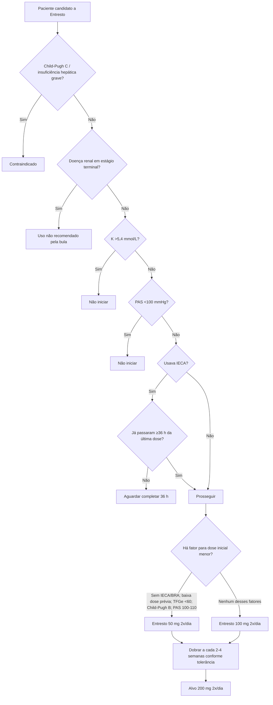

# Entresto — dose inicial, washout e titulação pela bula brasileira

## Dose inicial padrão

A bula profissional brasileira consultada recomenda **Entresto 100 mg duas vezes ao dia** como dose inicial padrão e **200 mg duas vezes ao dia** como dose-alvo.

A dose deve ser **dobrada a cada 2–4 semanas**, conforme tolerância.

## Quando usar 50 mg duas vezes ao dia

A dose inicial de **50 mg duas vezes ao dia** é recomendada ou deve ser considerada quando houver um dos seguintes contextos descritos na bula:

- paciente não está usando IECA ou BRA;
- uso prévio de baixa dose de IECA/BRA;
- TFGe 30–60 mL/min/1,73 m² — dose menor deve ser considerada;
- TFGe <30 mL/min/1,73 m² — dados clínicos limitados; dose inicial recomendada 50 mg 2x/dia e uso cuidadoso;
- insuficiência hepática moderada/Child-Pugh B — 50 mg 2x/dia com cautela;
- PAS entre **100 e 110 mmHg** — considerar 50 mg 2x/dia.

## Quando não iniciar

A bula determina que o tratamento **não deve ser iniciado** quando:

- potássio sérico **>5,4 mmol/L**;
- PAS **<100 mmHg**.

Além disso:

- Child-Pugh C/insuficiência hepática grave, cirrose biliar ou colestase: **contraindicado**;
- doença renal em estágio terminal: não há estudos e o uso **não é recomendado**.

## Washout do IECA

Entresto **não deve ser iniciado até pelo menos 36 horas após a última dose de um IECA**, pelo risco de angioedema.

A regra vale também para **IECA em baixa dose**. A calculadora separa “IECA em baixa dose” de “BRA em baixa dose” para impedir que um paciente vindo de IECA passe diretamente para ARNI por erro de interface.

Se Entresto for interrompido e houver intenção de iniciar IECA, a bula também determina intervalo de **36 horas após a última dose de Entresto**.

## BRA

Entresto já contém valsartana e **não deve ser coadministrado com outro BRA**. A bula não estabelece o mesmo washout de 36 horas para BRA que estabelece para IECA, mas o BRA concomitante deve ser suspenso.

## Monitorização durante titulação

Hipotensão, hipercalemia e piora renal podem exigir ajuste de medicamentos concomitantes ou redução temporária da dose de Entresto. A bula recomenda monitorizar PA, função renal e potássio, especialmente em pacientes com maior risco.

## Fonte

Entresto® (sacubitril valsartana sódica hidratada). Bula profissional Novartis Brasil, **VPS15 Entresto_Bula_Profissional**, versão disponibilizada no portal NovartisPro em 2025 e aprovada junto à ANVISA.
