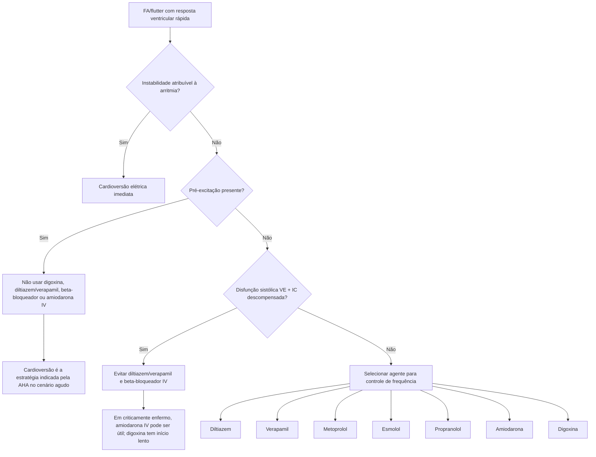

# FA/flutter com resposta ventricular rápida — doses IV e árvore de decisão

O ponto de partida não é escolher o fármaco. Antes de calcular dose, é necessário excluir **instabilidade hemodinâmica**, **pré-excitação** e **insuficiência cardíaca sistólica descompensada**, porque esses cenários mudam a estratégia e podem transformar um bloqueador nodal aparentemente rotineiro em uma intervenção perigosa.

## Doses da tabela AHA 2025

### Diltiazem
- 0,25 mg/kg IV em 2 minutos.
- Infusão 5–10 mg/h.
- Evitar em hipotensão, insuficiência cardíaca, cardiomiopatia e síndrome coronariana aguda segundo a tabela AHA 2025.

### Verapamil
- 0,075–0,15 mg/kg IV em 2 minutos.
- Pode ser administrada dose adicional após 30 minutos se não houver resposta.
- Infusão: 0,005 mg/kg/min.
- Evitar em hipotensão, insuficiência cardíaca, cardiomiopatia e síndrome coronariana aguda.

### Metoprolol
- 2,5–5 mg IV em 2 minutos.
- Até 3 doses.
- Evitar em insuficiência cardíaca descompensada.

### Esmolol
- Bolus 500 mcg/kg IV em 1 minuto.
- Infusão 50–300 mcg/kg/min.
- Curta duração de ação; evitar em insuficiência cardíaca descompensada.

### Propranolol
- 1 mg IV em 1 minuto.
- Até 3 doses.
- Evitar em insuficiência cardíaca descompensada.

### Amiodarona
- 300 mg IV em 1 hora.
- Depois 10–50 mg/h por 24 horas.
- A AHA 2025 considera a amiodarona IV útil para controle de frequência em pacientes criticamente enfermos com FA e resposta rápida **sem pré-excitação** quando outros bloqueadores não são apropriados.

### Digoxina
- 0,25 mg IV, podendo repetir até máximo de 1,5 mg em 24 horas.
- Início de ação mais lento; usar com cautela em disfunção renal.

## Regras de segurança incorporadas à calculadora

- **Instabilidade:** a calculadora não oferece dose e orienta cardioversão.
- **Pré-excitação:** a calculadora não sugere bloqueadores nodais nem amiodarona IV.
- **IC sistólica descompensada:** diltiazem, verapamil e beta-bloqueadores IV ficam bloqueados.
- O peso é usado apenas nos fármacos peso-ajustados; a interface mantém o dado disponível para evitar troca de unidade entre bolus e infusão.

## Referência

Wigginton JG, Agarwal S, Bartos JA, et al. *Part 9: Advanced Life Support: 2025 American Heart Association Guidelines for Cardiopulmonary Resuscitation and Emergency Cardiovascular Care*. Circulation. 2025;152(Suppl 2):S538-S577. DOI: **10.1161/CIR.0000000000001376**.
