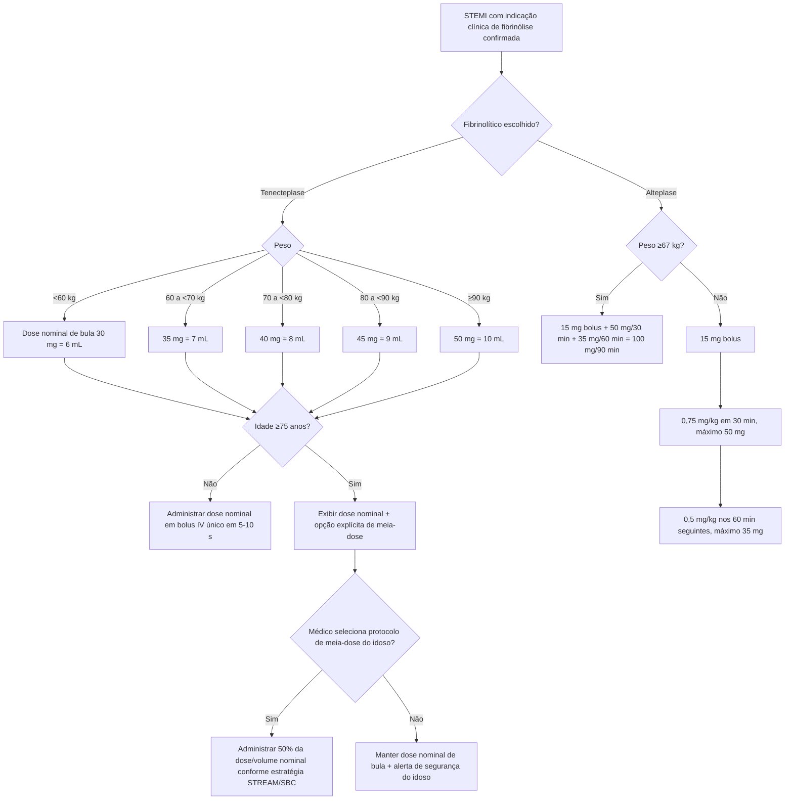

# Fibrinolíticos no STEMI — árvore de dose

Esta árvore começa **depois** de o médico confirmar que a fibrinólise é uma estratégia de reperfusão apropriada e que não existem contraindicações. Ela não decide entre fibrinólise e ICP primária.

## Tenecteplase — Metalyse

A bula profissional brasileira consultada informa solução reconstituída com **5 mg/mL** e as seguintes doses nominais:

| Peso | Dose | Volume |
|---|---:|---:|
| <60 kg | 30 mg | 6 mL |
| 60 a <70 kg | 35 mg | 7 mL |
| 70 a <80 kg | 40 mg | 8 mL |
| 80 a <90 kg | 45 mg | 9 mL |
| ≥90 kg | 50 mg | 10 mL |

A dose é administrada como **bolus IV único em aproximadamente 5–10 segundos**.

### Idoso

A seção de estudos clínicos da própria bula descreve que, no STREAM, após 382 pacientes, a dose foi reduzida pela metade nos pacientes **≥75 anos** por maior incidência de hemorragia intracraniana nesse subgrupo. Após a mudança, não ocorreu HIC em 0/97 pacientes idosos que receberam a meia-dose, enquanto antes da mudança ocorreram 3 eventos em 37 pacientes; os intervalos de confiança eram amplos e sobrepostos.

A Atualização das Diretrizes em Cardiogeriatria da SBC de 2019 também orienta que, se tenecteplase for utilizado no idoso >75 anos, seja aplicada metade da dose.

**Implementação da Corvia:** a calculadora não modifica silenciosamente a tabela de bula. Em paciente ≥75 anos, ela exibe a dose nominal e habilita uma opção explícita de **meia-dose do protocolo de idoso**. Assim, o médico vê qual regra está escolhendo.

## Alteplase — esquema acelerado de 90 minutos

A diretriz ACC/AHA de SCA 2025 fornece dois ramos:

### Peso ≥67 kg
- 15 mg IV em bolus;
- 50 mg IV em 30 minutos;
- 35 mg IV nos 60 minutos seguintes;
- total: **100 mg em 90 minutos**.

### Peso <67 kg
- 15 mg IV em bolus;
- 0,75 mg/kg IV em 30 minutos, máximo **50 mg**;
- 0,5 mg/kg IV nos 60 minutos seguintes, máximo **35 mg**.

O corte em 67 kg é tratado como ramo explícito na calculadora, não como simples aplicação de tetos à fórmula peso-ajustada.

## Erros que a calculadora tenta evitar

1. Usar dose de tenecteplase de **AVC** no STEMI ou vice-versa.
2. Aplicar meia-dose do idoso sem deixar claro que ela não é a linha nominal da tabela posológica brasileira.
3. Esquecer que **67 kg** já entra no esquema fixo de alteplase 100 mg.
4. Ignorar os tetos de 50/35 mg no ramo de alteplase <67 kg.
5. Administrar fibrinolítico antes de revisar contraindicações hemorrágicas e a possibilidade de ICP primária em tempo adequado.

## Fontes

- Metalyse® (tenecteplase), bula profissional Boehringer Ingelheim, código 07-5773227/07-5775310/P23-02.
- Atualização das Diretrizes em Cardiogeriatria da Sociedade Brasileira de Cardiologia – 2019.
- Rao SV, O'Donoghue ML, Ruel M, et al. 2025 ACC/AHA/ACEP/NAEMSP/SCAI Guideline for the Management of Patients With Acute Coronary Syndromes. J Am Coll Cardiol. 2025. DOI **10.1016/j.jacc.2024.11.009**.
