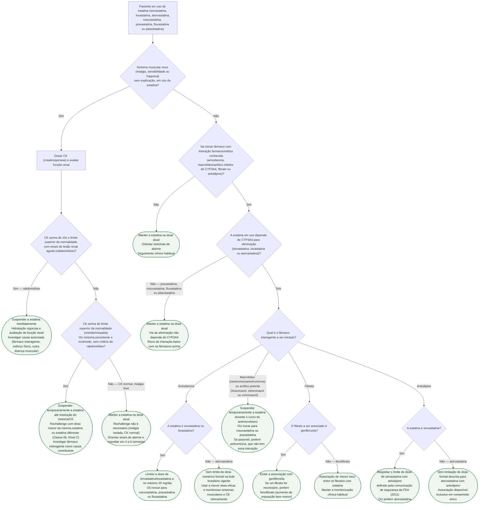

# Fluxograma: ajuste ou troca de estatina por interação medicamentosa (CYP3A4) ou miopatia

Duas perguntas cobrem a maior parte das decisões de ajuste de estatina no consultório: "esse sintoma muscular é motivo para suspender?" e "posso manter a estatina com esse fármaco novo?" A resposta depende, nos dois casos, da mesma informação estrutural — se a estatina em uso depende do CYP3A4 para ser eliminada (sinvastatina, lovastatina e, em menor grau, atorvastatina) ou não (rosuvastatina, pravastatina, fluvastatina, pitavastatina). O guideline AHA/ACC/multissociedades de 2018 sobre manejo do colesterol prefere, inclusive, o termo "efeitos colaterais associados à estatina" a "intolerância à estatina", porque a maioria dos pacientes tolera reintrodução em dose menor ou com estatina diferente.

## Árvore de decisão

## O que a árvore não mostra

- **O guideline AHA/ACC/multissociedades de 2018 não define um corte numérico de CK entre "acima do limite superior" e "10x o limite superior"** — a Table 11 do documento classifica só três patamares (mialgia com CK normal; miosite/miopatia com CK acima do limite superior; rabdomiólise com CK acima de 10x o limite superior associada a lesão renal), e é exatamente esse vocabulário que a árvore usa. Um corte intermediário (por exemplo "3 a 10x") não foi encontrado no texto consultado desta fonte e não foi inventado.
- **A recomendação de rechallenge (dose menor ou estatina diferente) é Classe IIb, Nível de evidência C** — ou seja, é razoável tentar, não uma obrigação; a decisão de reintroduzir depende do valor prognóstico da estatina para aquele paciente (prevenção secundária, LDL muito elevado) e da preferência dele após discutir o risco.
- **Nem toda estatina que depende de CYP3A4 tem o mesmo risco.** Sinvastatina e lovastatina têm o maior risco documentado e, no caso da sinvastatina, limite de dose formal em bula brasileira com amiodarona e com anlodipino; a atorvastatina, apesar de também depender de CYP3A4, tem risco descrito como "moderado" na literatura e não tem limite numérico formal em bula brasileira para essas duas combinações — o que não equivale a ausência de risco.
- **Itraconazol, cetoconazol e voriconazol são classificados na mesma categoria de inibidor potente de CYP3A4** (aumento de cerca de 19 vezes na AUC da sinvastatina ácida com itraconazol, em estudo farmacocinético cruzado) — a árvore os agrupa com os macrolídeos inibidores porque a conduta recomendada nas fontes consultadas é a mesma (suspender temporariamente ou trocar de estatina), mas o fluconazol tem potência de inibição bem menor e geralmente só é clinicamente relevante em dose ≥200 mg/dia — não está incluído neste ramo de alto risco.
- **Azitromicina não compartilha a interação dos demais macrolídeos** (não inibe CYP3A4) — foi usada como controle negativo no estudo de coorte citado, e por isso é a alternativa mais simples quando o paciente precisa de cobertura por macrolídeo e está em estatina CYP3A4-dependente.
- **Genfibrozila aumenta a exposição à estatina muito mais do que fenofibrato** (aumento de AUC de pravastatina de cerca de 202% com genfibrozila contra 19-28% com fenofibrato, em estudos farmacocinéticos cruzados com desenho comparável) — a diferença de magnitude, não apenas de direção, é o que sustenta preferir fenofibrato quando a associação com fibrato for necessária.
- **A árvore não cobre interação por outras vias** (por exemplo inibição de OATP1B1 por ciclosporina, ou de CYP2C8 por genfibrozila) nem a interação de estatina com inibidores de calcineurina no transplante cardíaco, já detalhada em outro documento desta biblioteca (`interacao-entre-inibidores-de-calcineurina-e-estatinas-no-transplante-cardiaco.md`).
- **Fatores de risco adicionais para miopatia** (idade avançada, sexo feminino, hipotireoidismo não tratado, insuficiência renal ou hepática, uso concomitante de outros hipolipemiantes) aumentam o risco absoluto além do que a interação isolada explica e devem pesar na decisão entre reduzir dose, trocar de estatina ou apenas monitorizar — a árvore simplifica isso para manter a estrutura de decisão única.
