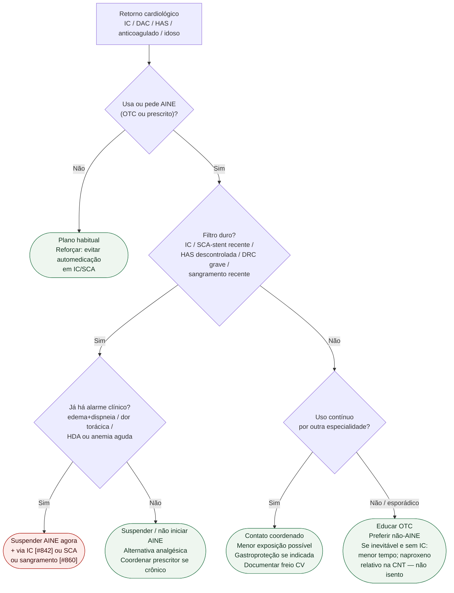

# Fluxograma ambulatorial: AINE — quando evitar e escalar

Prosa: [`sinalizadores-ambulatoriais-de-aine-no-paciente-cardiologico`](sinalizadores-ambulatoriais-de-aine-no-paciente-cardiologico.md). Checklist: [`checklist-ambulatorial-aine-no-retorno-cardiologico`](checklist-ambulatorial-aine-no-retorno-cardiologico.md). Magnitude CNT: [`anti-inflamatorios-nao-esteroidais-aines-e-risco-cardiovascular-metanalise-cnt`](../Geral/anti-inflamatorios-nao-esteroidais-aines-e-risco-cardiovascular-metanalise-cnt.md).

## Árvore de decisão

## Notas

- **D1**: ESC HF 2021 (evitar AINE na IC) + AHA 2007 (escada e freio pós-SCA) + CNT (IC de classe).
- **D2**: alarme clínico manda o destino; o AINE é precipitante, não diagnóstico diferencial completo.
- **C4**: PRECISION não autoriza liberalizar AINE em IC; só contextualiza comparação entre moléculas em artrite selecionada.
- Não decide dose, duração reumatológica nem substitui antiplaquetário/anticoagulante.
