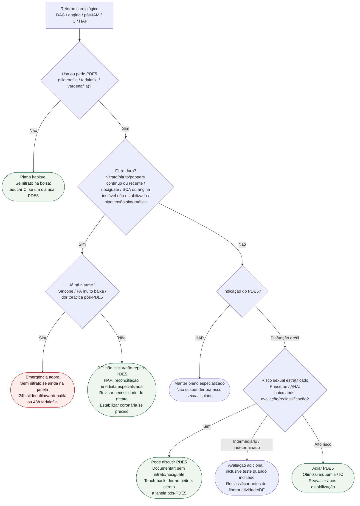

# Fluxograma ambulatorial: PDE5 — quando evitar e escalar

Prosa: [sinalizadores-ambulatoriais-pde5-e-nitrato](/biblioteca/sinalizadores-ambulatoriais-pde5-e-nitrato). Checklist: [checklist-ambulatorial-pde5-no-retorno-cardiologico](/biblioteca/checklist-ambulatorial-pde5-no-retorno-cardiologico). Monografia: [sildenafila-citrato](/biblioteca/sildenafila-citrato).

## Árvore de decisão

## Notas

- **D1**: CI absoluta PDE5×nitrato e PDE5×riociguate (AHA 2012; monografia); SCA não estabilizado (Princeton III).
- **C1**: dentro da janela pós-PDE5, nitrato de resgate clássico está **proibido** até avaliação do intervalo mínimo e da depuração.
- **C3**: liberação é de **segurança de interação + estratificação**, não posologia de DE.
- Não decide dose de sildenafila/tadalafila nem substitui urologia/HP.

## Aplicação segura das janelas

Registrar data e hora da última dose, molécula, repetição do uso, função renal/hepática e interações, sobretudo inibidores fortes de CYP3A4. Os mínimos de 24 h para sildenafila/vardenafila e 48 h para tadalafila não garantem segurança se depuração estiver prolongada; requerem avaliação individual e, quando necessário, decisão especializada com monitorização. Não aplicar esses intervalos no sentido nitrato → PDE5: formulação, duração de ação e necessidade clínica do nitrato determinam a transição. Para outros PDE5, como lodenafila, consultar a bula específica; não extrapolar intervalo.

Perguntar diretamente sobre nitritos recreativos/poppers: a combinação também é contraindicada. Reconciliação não significa escolher arbitrariamente qual terapia crônica retirar. Para DE, não repetir PDE5 até avaliação; se já houve uso recente, não administrar nitrato automaticamente. Se PDE5 trata HAP, contatar a equipe especializada imediatamente para impedir coadministração e definir ajuste seguro, sem retirar terapia de HAP com base apenas no risco da atividade sexual.
