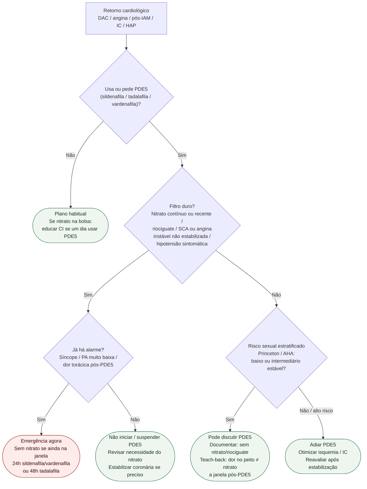

# Fluxograma ambulatorial: PDE5 — quando evitar e escalar

Prosa: [`sinalizadores-ambulatoriais-pde5-e-nitrato`](sinalizadores-ambulatoriais-pde5-e-nitrato.md). Checklist: [`checklist-ambulatorial-pde5-no-retorno-cardiologico`](checklist-ambulatorial-pde5-no-retorno-cardiologico.md). Monografia: [`sildenafila-citrato`](sildenafila-citrato.md).

## Árvore de decisão

## Notas

- **D1**: CI absoluta PDE5×nitrato e PDE5×riociguate (AHA 2012; monografia); SCA não estabilizado (Princeton III).
- **C1**: dentro da janela pós-PDE5, nitrato de resgate clássico está **proibido** até completar washout.
- **C3**: liberação é de **segurança de interação + estratificação**, não posologia de DE.
- Não decide dose de sildenafila/tadalafila nem substitui urologia/HP.
