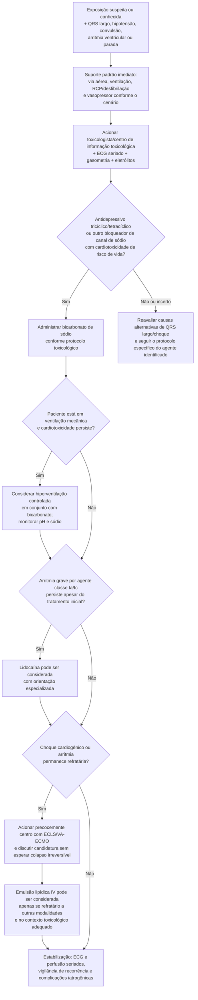

# Cardiotoxicidade grave por bloqueador de canal de sódio

## Como interpretar as caixas

- Para adultos com cardiotoxicidade de risco de vida por antidepressivo tricíclico ou tetracíclico, bicarbonato de sódio é recomendação classe 1, nível B-NR. Para outros bloqueadores de canal de sódio em adultos e crianças, é razoável (classe 2a, C-EO).
- Em paciente já intubado, hiperventilação em conjunto com bicarbonato é razoável (classe 2a, C-LD). Isso não autoriza alcalose sem controle: pH, sódio, potássio e resposta do QRS precisam ser acompanhados.
- Lidocaína, um antiarrítmico classe Ib, pode ser considerada para cardiotoxicidade por agentes classe Ia ou Ic (classe 2b, C-EO). Não é uma etapa universal para todo QRS largo.
- ECLS/VA-ECMO é razoável no choque cardiogênico refratário (classe 2a, C-EO). Emulsão lipídica tem recomendação mais fraca e fica reservada a toxicidade refratária a outras modalidades (classe 2b, C-EO).

## Fronteiras do fluxo

Cocaína e anestésicos locais também bloqueiam canais de sódio, mas possuem toxíndromes e recomendações próprias na diretriz. O fluxo acima é centrado em antidepressivos tricíclicos/tetracíclicos e outros agentes com fenótipo semelhante; não deve apagar a investigação de isquemia/hiperadrenergia por cocaína nem o manejo específico da toxicidade sistêmica por anestésico local.

## Tudo com Tudo

- [Diretriz AHA 2025: intoxicações cardiotóxicas graves](diretriz-aha-2025-intoxicacoes-cardiotoxicas-graves.md)
- [Cardiotoxicidade por tricíclicos, organofosforados e cloroquina](../Terapia_intensiva/cardiotoxicidade-intoxicacao-exogena-triciclicos-organofosforados-cloroquina.md)
- [Antidepressivos tricíclicos no cardiopata](../Saúde_mental_e_cardiologia/antidepressivos-triciclicos-no-cardiopata-risco-cardiovascular-e-toxicidade-em-superdosagem.md)
- [Flecainida](flecainida.md)
- [Propafenona](propafenona-cloridrato.md)
- [Cardiotoxicidade aguda por cocaína](../Terapia_intensiva/cardiotoxicidade-aguda-por-cocaina-vasoespasmo-bloqueio-de-canal-de-sodio-e-por-que-nao-usar-betabloqueador-isolado.md)
- [Taquicardia de QRS largo sem diagnóstico estabelecido](../Arritmias/fluxograma-taquicardia-de-qrs-largo-esc-2019.md)
- [Parada cardiorrespiratória no adulto](../Terapia_intensiva/fluxograma-parada-cardiorrespiratoria-ritmo-inicial.md)

## Limite operacional

Intoxicação grave é uma emergência dinâmica. O ECG e a pressão podem piorar rapidamente, e a dose total necessária de terapia varia. Este fluxograma organiza prioridades e escalonamento; não substitui orientação toxicológica, tabela de doses, monitorização intensiva ou protocolo local.
