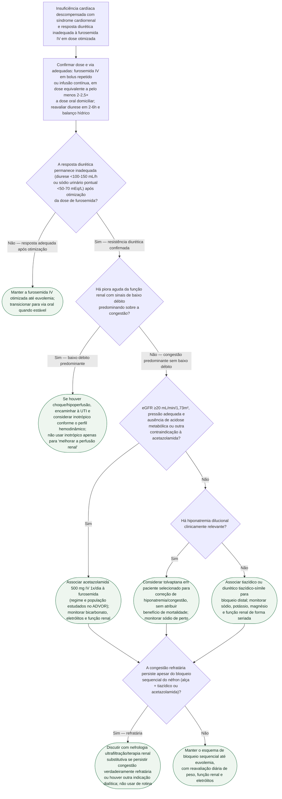

# Fluxograma: diurético resistente na síndrome cardiorrenal

Quando a furosemida IV não produz diurese suficiente num paciente com insuficiência cardíaca descompensada, o primeiro passo é confirmar administração e escalonamento adequados do diurético de alça. Se a resposta continuar insuficiente, o **bloqueio sequencial do néfron** associa um segundo diurético em outro segmento tubular — acetazolamida no túbulo proximal ou tiazídico no túbulo distal — com monitorização estreita. Ultrafiltração não é o degrau automático seguinte e fica reservada a casos selecionados, refratários ou com indicação dialítica.

## Árvore de decisão

## O que a árvore não mostra

- **A síndrome cardiorrenal tem cinco subtipos** pela classificação da ADQI (agudo/crônico, cardiorrenal/renocardíaco, sistêmico) — esta árvore trata do manejo prático do diurético resistente à beira do leito, não da classificação etiológica completa do subtipo.
- **Piora transitória de creatinina durante descongestionamento agressivo** ("pseudo-piora renal") não deve, sozinha, interromper a diurese em paciente ainda congesto — a decisão de reduzir diurético pelo aumento de creatinina precisa considerar o contexto de volume, não só o número.
- **Monitorização eletrolítica é obrigatória e mais frequente** com bloqueio sequencial do néfron do que com furosemida isolada — hipopotassemia, hipomagnesemia e alcalose metabólica são riscos reais da combinação, e a árvore não substitui a rotina de eletrólitos seriados.
- **Disponibilidade de ultrafiltração varia muito entre serviços** — o encaminhamento do último ramo pode não ser factível em tempo hábil em todo hospital, e a decisão prática às vezes é manter otimização clínica enquanto se organiza a transferência.
- **Albumina associada à furosemida não é estratégia rotineira validada.** Hipoalbuminemia e síndrome nefrótica exigem avaliação individual, sem presumir benefício clínico da infusão de albumina.
