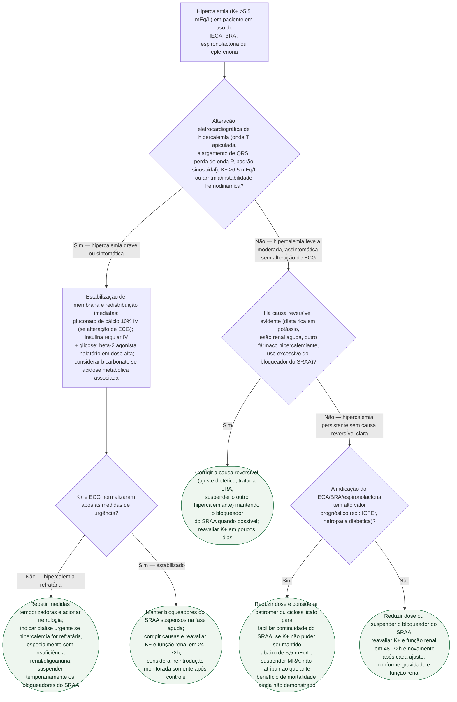

# Fluxograma: hipercalemia em uso de IECA, BRA ou espironolactona

Hipercalemia associada ao bloqueio do sistema renina-angiotensina-aldosterona exige equilibrar a urgência do potássio com a indicação prognóstica do fármaco. OPAL-HK e HARMONIZE demonstraram que patiromer e ciclossilicato de sódio e zircônio reduzem e controlam o potássio; não foram desenhados para demonstrar redução de mortalidade. Na hipercalemia grave, o bloqueador deve ser interrompido temporariamente enquanto se estabiliza o paciente; eventual reintrodução é posterior, individualizada e monitorada.

## Árvore de decisão

## O que a árvore não mostra

- **Pseudo-hipercalemia por hemólise deve ser descartada** diante de valor limítrofe e inesperado, sobretudo sem alteração de ECG. Repetir a coleta corretamente, mas nunca atrasar estabilização quando houver alteração eletrocardiográfica, arritmia ou instabilidade.
- **Patiromer e ciclossilicato não substituem cálcio, insulina/glicose e remoção definitiva na emergência.** O ciclossilicato pode iniciar redução em horas, mas não deve ser usado como monoterapia na hipercalemia com alteração eletrocardiográfica ou instabilidade.
- **Gluconato de cálcio não reduz o potássio sérico** — estabiliza a membrana miocárdica por minutos, ganhando tempo para as medidas de redistribuição e remoção fazerem efeito; é preciso associar, não substituir.
- **O corte de K+ que justifica reintrodução do bloqueador do SRAA** varia por diretriz e por comorbidade — a árvore usa o critério prático de reavaliação em 24-72h ou 1-2 semanas, mas o limiar exato é decisão clínica individualizada.
- **Dieta com baixo teor de potássio e revisão de outros fármacos hipercalemiantes** (AINE, trimetoprima, suplementos de potássio) deveriam ser checados em todo paciente, não apenas no ramo de "causa reversível" — a árvore simplifica isso para manter a estrutura de decisão única.
- **Diálise de urgência exige acesso vascular e disponibilidade de máquina/equipe**, nem sempre imediatos — enquanto isso, as medidas de redistribuição continuam sendo repetidas.
