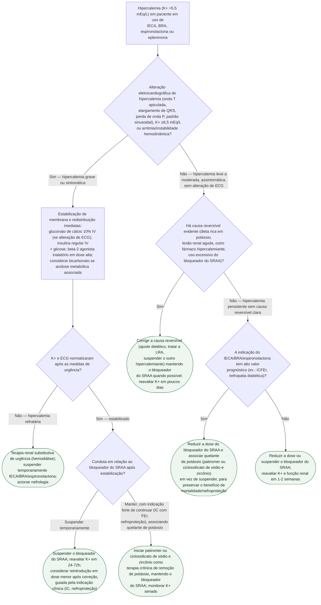

# Fluxograma: hipercalemia em uso de IECA, BRA ou espironolactona

Hipercalemia associada a bloqueador do sistema renina-angiotensina-aldosterona é o motivo mais comum de suspensão precoce de um fármaco que reduz mortalidade — e a suspensão reflexa costuma ser a resposta errada. Quando a indicação tem alto valor prognóstico (insuficiência cardíaca com fração de ejeção reduzida, nefropatia diabética), a estratégia validada por ensaios como o OPAL-HK (patiromer) e o HARMONIZE (ciclossilicato de sódio e zircônio) é reduzir a dose e associar um quelante crônico de potássio, preservando o benefício do bloqueio do SRAA, em vez de simplesmente suspender.

## Árvore de decisão

## O que a árvore não mostra

- **Pseudo-hipercalemia por hemólise da amostra é a primeira coisa a descartar** diante de um valor limítrofe e inesperado, sobretudo sem alteração de ECG — repetir a coleta sem torniquete prolongado antes de agir sobre um número isolado.
- **Patiromer e ciclossilicato de sódio e zircônio levam horas a dias para reduzir o potássio de forma relevante** — não servem para a fase aguda/grave, que depende das medidas de estabilização de membrana e redistribuição.
- **Gluconato de cálcio não reduz o potássio sérico** — estabiliza a membrana miocárdica por minutos, ganhando tempo para as medidas de redistribuição e remoção fazerem efeito; é preciso associar, não substituir.
- **O corte de K+ que justifica reintrodução do bloqueador do SRAA** varia por diretriz e por comorbidade — a árvore usa o critério prático de reavaliação em 24-72h ou 1-2 semanas, mas o limiar exato é decisão clínica individualizada.
- **Dieta com baixo teor de potássio e revisão de outros fármacos hipercalemiantes** (AINE, trimetoprima, suplementos de potássio) deveriam ser checados em todo paciente, não apenas no ramo de "causa reversível" — a árvore simplifica isso para manter a estrutura de decisão única.
- **Diálise de urgência exige acesso vascular e disponibilidade de máquina/equipe**, nem sempre imediatos — enquanto isso, as medidas de redistribuição continuam sendo repetidas.