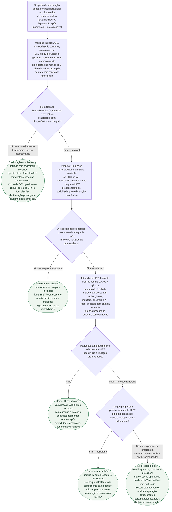

# Fluxograma: intoxicação por betabloqueador ou bloqueador de canal de cálcio

Intoxicação por betabloqueador ou bloqueador de canal de cálcio pode deteriorar rapidamente e costuma exigir tratamento multimodal. Na toxicidade com risco de vida, a AHA recomenda insulina em altas doses precocemente; no choque por bloqueador de canal de cálcio, cálcio, HIET e noradrenalina/epinefrina são terapias de primeira linha escolhidas e combinadas conforme o fenótipo hemodinâmico, sem esperar falha sequencial prolongada.

## Árvore de decisão

## O que a árvore não mostra

- **Coingestão com outros cardiotóxicos** (antidepressivo tricíclico, digoxina) muda o manejo — cada classe tem antídoto/estratégia própria, e a intoxicação mista exige abordagem combinada não detalhada aqui.
- **Formulações de liberação prolongada podem causar deterioração tardia.** A janela depende do agente e da formulação; em ingestão potencialmente tóxica de BCC, o consenso prefere cerca de 24 horas de monitorização hospitalar.
- **A HIET exige monitorização glicêmica e de potássio muito frequente.** A queda de K+ é sobretudo redistributiva; reposição excessiva pode causar hipercalemia de rebote, portanto deve ser cautelosa e protocolada.
- **Emulsão lipídica IV é terapia de resgate, não substituto inicial de HIET/vasopressor.** A evidência em BCC e betabloqueadores é de baixa qualidade e seu uso deve ocorrer com apoio toxicológico.
- **Carvão ativado só deve ser considerado com via aérea protegida e ingestão recente** — em paciente já bradicárdico/hipotenso ou com rebaixamento de consciência, o risco de aspiração pode superar o benefício.
- **Disponibilidade de ECMO é limitada** e a decisão de acioná-la depende de estrutura local e tempo de transporte — não é uma opção universalmente disponível no momento do choque refratário.
