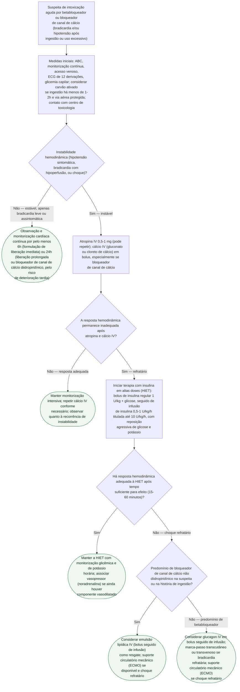

# Fluxograma: intoxicação por betabloqueador ou bloqueador de canal de cálcio

Intoxicação por betabloqueador ou bloqueador de canal de cálcio é uma das poucas emergências toxicológicas cardiovasculares em que o antídoto de primeira linha não é o mais óbvio: atropina e cálcio IV costumam ser insuficientes sozinhos, e o próximo degrau — insulina em altas doses (HIET) — soa contraintuitivo até se entender que ambas as classes de fármaco prejudicam a utilização miocárdica de glicose, e a insulina em dose supra-fisiológica restaura o inotropismo por essa via, além do efeito hemodinâmico direto. A atualização focada da AHA de 2023 sobre parada cardíaca e toxicidade formaliza esse escalonamento como abordagem baseada em evidência, não em experiência anedótica.

## Árvore de decisão

## O que a árvore não mostra

- **Coingestão com outros cardiotóxicos** (antidepressivo tricíclico, digoxina) muda o manejo — cada classe tem antídoto/estratégia própria, e a intoxicação mista exige abordagem combinada não detalhada aqui.
- **Formulações de liberação prolongada podem causar deterioração súbita e tardia**, mesmo após período inicial de estabilidade — a observação de 24h no ramo estável não é opcional para esses casos.
- **A HIET exige monitorização glicêmica horária e reposição agressiva de potássio**, com risco real de hipoglicemia e hipopotassemia graves se a infusão for interrompida abruptamente sem desmame — a árvore não detalha o protocolo de desmame.
- **Emulsão lipídica IV tem maior corpo de evidência para bloqueador de canal de cálcio lipofílico** (verapamil, especialmente) do que para betabloqueador; a recomendação para predomínio de betabloqueador é mais fraca e baseada em relato de caso.
- **Carvão ativado só deve ser considerado com via aérea protegida e ingestão recente** — em paciente já bradicárdico/hipotenso ou com rebaixamento de consciência, o risco de aspiração pode superar o benefício.
- **Disponibilidade de ECMO é limitada** e a decisão de acioná-la depende de estrutura local e tempo de transporte — não é uma opção universalmente disponível no momento do choque refratário.