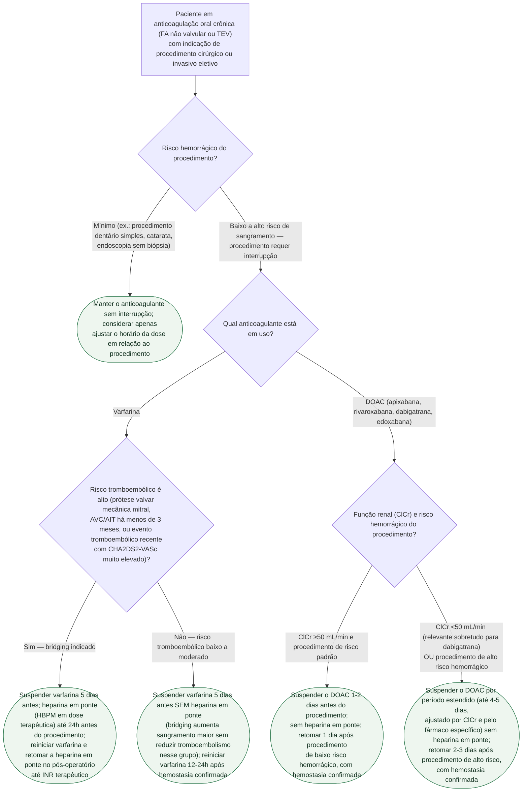

# Fluxograma: manejo perioperatório da anticoagulação — suspensão, bridging e retomada

A pergunta semanal de consultório — "suspendo o anticoagulante para a cirurgia, e faço ponte com heparina?" — tem resposta diferente para varfarina e para DOAC, e o erro mais caro é aplicar bridging por reflexo. O ensaio BRIDGE, randomizado e duplo-cego, mostrou que a ponte com heparina **triplica o sangramento maior** (3,2% vs. 1,3%) sem reduzir evento tromboembólico em pacientes com FA de risco baixo a moderado — bridging deveria ser exceção, reservado a quem tem risco tromboembólico alto, não rotina. Para o DOAC, o protocolo PAUSE validou que a suspensão guiada apenas por função renal e risco hemorrágico do procedimento, sem heparina em ponte, é segura na grande maioria dos casos.

## Árvore de decisão

## O que a árvore não mostra

- **Prótese valvar mecânica em qualquer posição costuma exigir bridging**, mesmo fora do subgrupo estudado no BRIDGE (que era FA não valvular) — a decisão nesse grupo segue protocolo próprio, mais conservador, e não está detalhada aqui.
- **Anestesia neuroaxial (raquianestesia/peridural) tem janela de segurança própria**, geralmente mais restritiva que a suspensão para cirurgia em si, por risco de hematoma espinhal — não coberta por esta árvore.
- **Antiagregantes plaquetários (AAS, clopidogrel) em uso concomitante** seguem lógica de suspensão independente, que pode ou não coincidir com a do anticoagulante — não estão representados aqui.
- **Procedimentos de emergência/urgência não seguem este fluxo** — nesse cenário, a pergunta é reversão emergencial, não suspensão planejada (ver o fluxograma de sangramento maior/reversão desta mesma pasta).
- **A decisão é sempre compartilhada e individualizada**: peso, sangramento prévio, fragilidade e preferência do paciente pesam além dos critérios objetivos de risco hemorrágico e tromboembólico listados na árvore.
- **Dabigatrana tem meia-vida mais sensível à função renal** que os demais DOAC — a suspensão pode precisar ser ainda mais prolongada que a indicada para apixabana/rivaroxabana/edoxabana em ClCr muito reduzido, e essa granularidade fina fica para a bula específica do fármaco.