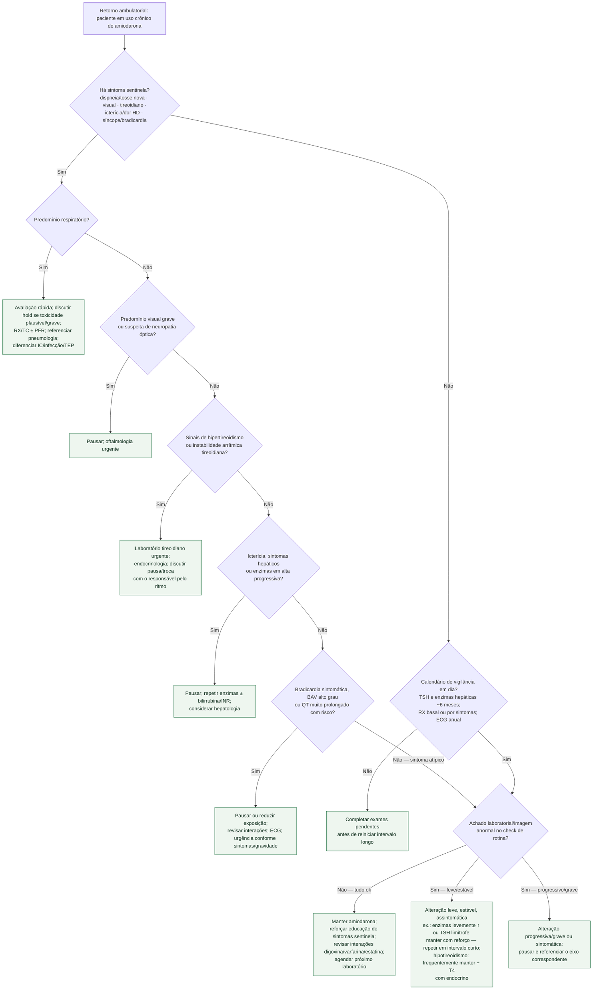

# Fluxograma: monitoramento ambulatorial da amiodarona

Uso crônico de amiodarona exige vigilância multissistêmica. Este fluxograma traduz o protocolo textual irmão em árvore de decisão para o retorno ambulatorial. Intervalos de laboratório/imagem seguem a lógica qualitativa alinhada a diretrizes de FA (ESC/AHA) e ao mnemônico TRETA do corpus — **sem inventar cortes percentuais de ensaio**.

## Árvore de decisão

## O que a árvore não mostra

- **Posologia** de ataque/manutenção — ver monografia e bulas.
- **Percentuais de incidência** — não são necessários para decidir pausar vs reforçar.
- **Toxicidade pulmonar** pode apresentar-se de forma subaguda; ausência de febre não afasta.
- **Após pausa**, a meia-vida longa implica que melhora clínica/laboratorial pode ser lenta.
- Interação **amiodarona–digoxina**: se houver sinalizadores de digitálico, seguir `sinalizadores-ambulatoriais-de-toxicidade-da-digoxina.md` em paralelo.

## Fonte do calendário e interação prospectiva

Tabela 24, ACC/AHA/ACCP/HRS 2023 (DOI 10.1161/CIR.0000000000001193): TSH e AST/ALT basais, em 3–6 meses e depois semestralmente; ECG basal e anual; RX basal e por sintomas; TC conforme indicação. Ao iniciar amiodarona em usuário de digoxina, revisar prospectivamente esquema, nível e monitorização com o prescritor; não esperar toxicidade. A pausa da amiodarona não reverte imediatamente seus efeitos por sua meia-vida longa.
