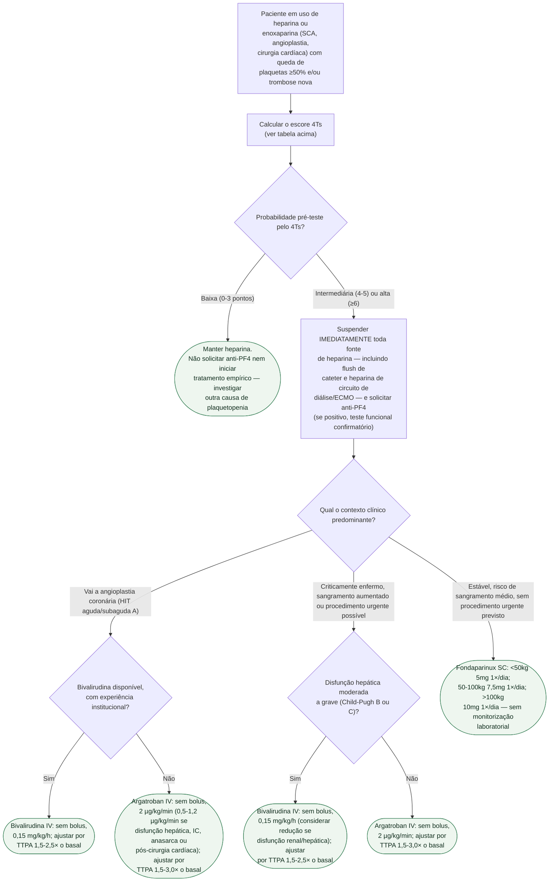

# Fluxograma: Queda de plaquetas em uso de heparina/enoxaparina — suspeita de HIT

A trombocitopenia induzida por heparina (HIT) é protrombótica, não hemorrágica: o paciente que cai a plaqueta em vigência de heparina ou enoxaparina não está sangrando mais, está coagulando mais. O risco diário de trombose, amputação ou morte sem tratamento (5% a 10%, segundo a diretriz da ASH) é por isso que a decisão de suspender heparina e trocar o anticoagulante costuma ser tomada **antes** da confirmação laboratorial, com base só na probabilidade clínica pelo escore 4Ts.

## Escore 4Ts: probabilidade pré-teste

| Critério | 0 pontos | 1 ponto | 2 pontos |
|---|---|---|---|
| **T**rombocitopenia | Queda <30% ou nadir <10 × 10⁹/L | Queda 30-50% ou nadir 10-19 × 10⁹/L | Queda >50% **e** nadir ≥20 × 10⁹/L |
| **T**iming (momento da queda) | ≤4 dias, sem exposição recente à heparina | Provavelmente 5-10 dias mas não definido, início após o dia 10, ou ≤1 dia com exposição prévia à heparina 30-100 dias antes | 5-10 dias, ou ≤1 dia com exposição prévia à heparina nos últimos 30 dias |
| **T**rombose ou outra sequela | Nenhuma | Trombose progressiva ou recorrente, trombose suspeita, ou lesão de pele eritematosa não necrosante | Trombose nova confirmada, necrose de pele, ou reação sistêmica aguda após bolus IV de heparina |
| oT**her** causas de plaquetopenia | Definida (outra causa clara) | Possível | Nenhuma outra causa aparente |

**Soma:** 0-3 pontos = baixa probabilidade (<5%); 4-5 pontos = intermediária (14%); ≥6 pontos = alta (64%).

## Árvore de decisão

## Transfusão de plaquetas: nunca profilática

Ponto que contraria a intuição de "repor o que está baixo": em HIT (isolada ou com trombose) e risco hemorrágico médio, a diretriz da ASH **recomenda contra a transfusão profilática de plaquetas** — o problema não é a falta de plaqueta, é a ativação plaquetária, e transfundir pode, em tese, alimentar mais substrato para o processo protrombótico. Transfusão de plaquetas fica reservada para **sangramento ativo ou alto risco hemorrágico**, em qualquer um dos ramos acima.

## Depois da fase aguda: recuperação de plaqueta e transição

Em todos os ramos de tratamento, a anticoagulação não heparínica é mantida, no mínimo, **até a recuperação da contagem de plaquetas** (em geral ≥150 × 10⁹/L, o que marca a fase subaguda A). A partir daí, a diretriz sugere transicionar para via oral com **preferência por um DOAC em vez de antagonista de vitamina K (varfarina)** nessa fase. Na HIT isolada (sem trombose documentada), não há indicação de prolongar o tratamento por ≥3 meses de rotina, a menos que haja trombose persistente ou outra indicação.
