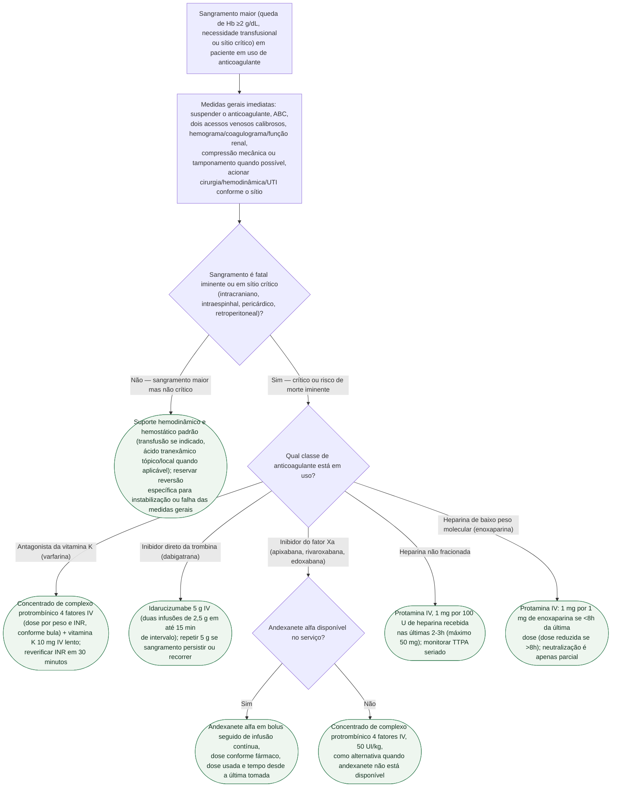

# Fluxograma: sangramento maior em paciente anticoagulado — reversão emergencial

Sangramento maior num paciente anticoagulado não é uma única decisão — é duas: primeiro, se a gravidade e o sítio justificam reversão farmacológica específica (não todo sangramento maior precisa disso); depois, qual agente reverte qual classe de anticoagulante, porque idarucizumabe não faz nada por um inibidor do fator Xa e protamina não neutraliza um DOAC. O consenso da ACC de 2020 é explícito: reversão específica é reservada para sangramento fatal iminente ou em sítio crítico, e as medidas gerais de suporte (compressão, hemostasia local, transfusão) continuam sendo a base do tratamento em toda a árvore, não apenas no ramo sem reversão.

## Árvore de decisão

## O que a árvore não mostra

- **Andexanete alfa tem disponibilidade limitada no Brasil** — o ramo que usa CCP 4F como alternativa ao inibidor do fator Xa é, na prática, o caminho mais usado na maioria dos serviços, não uma exceção rara.
- **Idarucizumabe não é ajustado por função renal na dose de reversão**, mas a dabigatrana acumula em disfunção renal — redosagem pode ser necessária se o sangramento recorrer, especialmente em ClCr baixo.
- **Carvão ativado** pode ser considerado se a ingestão do anticoagulante oral foi recente (dentro de 2-4h) e a via aérea está protegida — não é mostrado na árvore por ser medida complementar, não de reversão.
- **Reversão farmacológica não substitui hemostasia mecânica ou cirúrgica** quando o sítio permite (endoscopia, embolização, cirurgia) — a árvore trata da farmacologia, não do controle definitivo do foco de sangramento.
- **Neutralização da HBPM por protamina é sempre parcial** (reverte cerca de 60% da atividade anti-Xa) — se o sangramento persistir apesar da protamina, considerar CCP 4F como medida adjuvante, mesmo sem evidência robusta específica para esse cenário.
- **A decisão de reintroduzir o anticoagulante após o sangramento** é individualizada (risco tromboembólico vs. risco de resangramento) e está fora do escopo desta árvore, que cobre apenas a fase aguda de reversão.