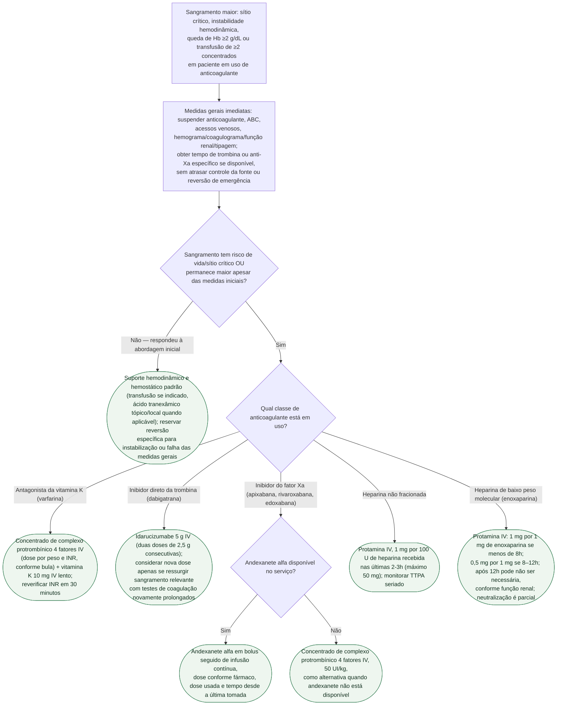

# Fluxograma: sangramento maior em paciente anticoagulado — reversão emergencial

Sangramento maior num paciente anticoagulado exige controle imediato da fonte e decisão sobre reversão. O consenso ACC 2020 considera agente de reversão no sangramento com risco de vida e também no sangramento maior que não se resolve com a abordagem inicial; ele não deve ser usado na maioria dos sangramentos não maiores. A escolha depende do anticoagulante e da presença de efeito farmacológico clinicamente relevante.

## Árvore de decisão

## O que a árvore não mostra

- **Andexanete alfa tem disponibilidade limitada no Brasil** — o ramo que usa CCP 4F como alternativa ao inibidor do fator Xa é, na prática, o caminho mais usado na maioria dos serviços, não uma exceção rara.
- **Idarucizumabe não é ajustado por função renal na dose de reversão**, mas a dabigatrana acumula em disfunção renal — redosagem pode ser necessária se o sangramento recorrer, especialmente em ClCr baixo.
- **Carvão ativado** pode ser considerado se a ingestão do anticoagulante oral foi recente (dentro de 2-4h) e a via aérea está protegida — não é mostrado na árvore por ser medida complementar, não de reversão.
- **Reversão farmacológica não substitui hemostasia mecânica ou cirúrgica** quando o sítio permite (endoscopia, embolização, cirurgia) — a árvore trata da farmacologia, não do controle definitivo do foco de sangramento.
- **Neutralização da HBPM por protamina é parcial** (aproximadamente 60% da atividade anti-Xa). Persistência exige controle da fonte, suporte e consulta hematológica/toxicológica; não há antídoto específico que complete a reversão.
- **A decisão de reintroduzir o anticoagulante após o sangramento** é individualizada (risco tromboembólico vs. risco de resangramento) e está fora do escopo desta árvore, que cobre apenas a fase aguda de reversão.
