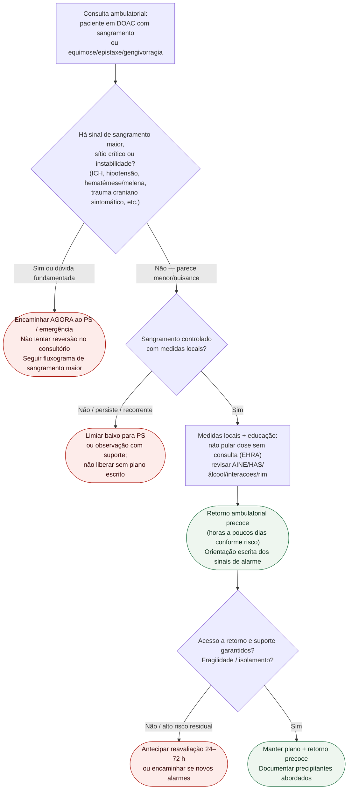

# Fluxograma: sinalizadores ambulatoriais de sangramento em DOAC

Prosa: [`sinalizadores-ambulatoriais-doac-sangramento-quando-encaminhar`](sinalizadores-ambulatoriais-doac-sangramento-quando-encaminhar.md). Braço menor: [`sangramento-menor-doac-no-consultorio-conduta-ambulatorial`](sangramento-menor-doac-no-consultorio-conduta-ambulatorial.md). Reversão aguda: [`fluxograma-sangramento-maior-em-anticoagulante-reversao-emergencial`](fluxograma-sangramento-maior-em-anticoagulante-reversao-emergencial.md).

## Árvore de decisão

## Notas

- **D1** = gate de segurança (EHRA 2021: tipo de sangramento).
- **D2** = controle local — se falha, não insistir no consultório.
- **D3** = logística/fragilidade muda o prazo do retorno.
- A árvore **não** decide antídoto, CCP, dose ou quantas tomadas pausar.
