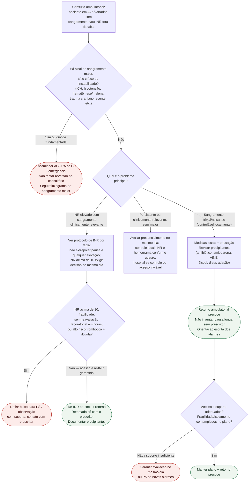

# Fluxograma: sinalizadores ambulatoriais de varfarina

Prosa: [sinalizadores-ambulatoriais-varfarina-inr-sangramento-quando-encaminhar](/biblioteca/sinalizadores-ambulatoriais-varfarina-inr-sangramento-quando-encaminhar). Braço INR sem sangramento: [inr-elevado-sem-sangramento-no-consultorio-conduta-ambulatorial](/biblioteca/inr-elevado-sem-sangramento-no-consultorio-conduta-ambulatorial). Reversão aguda: [fluxograma-sangramento-maior-em-anticoagulante-reversao-emergencial](/biblioteca/fluxograma-sangramento-maior-em-anticoagulante-reversao-emergencial).

## Árvore de decisão

## Notas

- **D1** = gate de segurança (ASH 2018: reversão agressiva para sangramento ameaçador à vida).
- **D2** = separa sangramento menor de INR outlier assintomático — condutas diferentes.
- **D3** = logística/fragilidade/extremidade do INR muda o destino.
- A árvore **não** decide miligramas de varfarina, vitamina K, CCP nem meta de INR por indicação.
