# Síndrome BRASH

```mermaid
flowchart TD
  R0["Bradicardia/bloqueio AV + disfunção renal<br/>+ hipercalemia + uso de bloqueador nodal"]
  D1{"Há hipotensão, choque ou hipoperfusão?"}
  P1["Suspender temporariamente bloqueador nodal<br/>+ monitorização contínua + acesso venoso"]
  P2["Tratar hipercalemia imediatamente<br/>conforme protocolo dedicado"]
  P3["Investigar/corrigir precipitante renal:<br/>hipovolemia, infecção, perdas, nefrotóxicos, congestão"]
  D2{"Bradicardia/choque persiste após<br/>início da correção metabólica?"}
  P4["Suporte cronotrópico/inotrópico/vasopressor<br/>individualizado; não depender apenas de atropina"]
  D3{"Instabilidade refratária ou bloqueio<br/>grave persistente?"}
  P5["Considerar pacing temporário/transcutâneo<br/>e suporte intensivo"]
  D4{"Hipercalemia/IRA refratária ou<br/>indicação nefrológica de TRS?"}
  P6["Acionar nefrologia e considerar<br/>terapia renal substitutiva"]
  D5{"Há evidência de overdose verdadeira<br/>de BB/BCC além do ciclo BRASH?"}
  P7["Seguir também protocolo toxicológico<br/>de betabloqueador/BCC"]
  C1(["Estabilizado: reavaliar função renal,<br/>potássio e necessidade/reintrodução dos fármacos"])

  R0 --> D1
  D1 -->|"Sim"| P1
  D1 -->|"Não"| P1
  P1 --> P2
  P2 --> P3
  P3 --> D2
  D2 -->|"Sim"| P4
  D2 -->|"Não"| D4
  P4 --> D3
  D3 -->|"Sim"| P5
  D3 -->|"Não"| D4
  P5 --> D4
  D4 -->|"Sim"| P6
  D4 -->|"Não"| D5
  P6 --> D5
  D5 -->|"Sim"| P7
  D5 -->|"Não"| C1
  P7 --> C1

  classDef conduta fill:#eef6ef,stroke:#2f7a4f,color:#12301f;
  class C1 conduta;
```

## Regra prática

BRASH é um **ciclo**, não cinco problemas independentes. O erro mais comum é tratar somente a frequência cardíaca ou somente o potássio; o manejo deve quebrar simultaneamente bloqueio nodal, hipercalemia, disfunção renal e hipoperfusão.