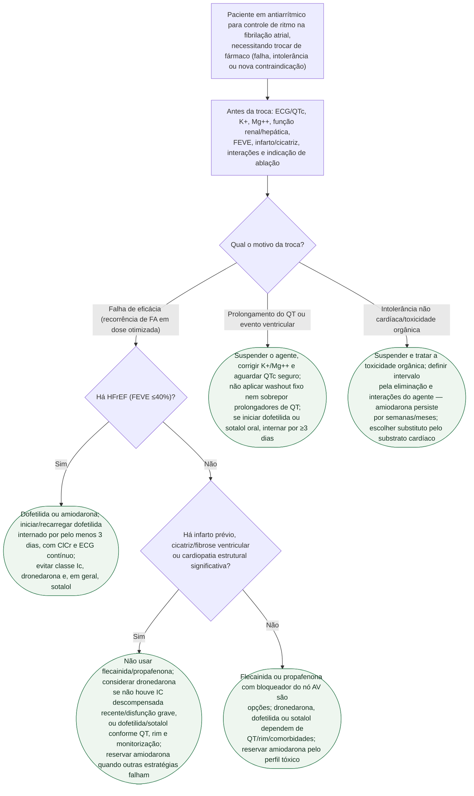

# Fluxograma: transição entre antiarrítmicos no controle de ritmo da fibrilação atrial

Trocar de antiarrítmico na fibrilação atrial exige reavaliar se o controle de ritmo farmacológico ainda é a melhor estratégia, o substrato cardíaco e a toxicidade que motivou a troca. Não existe um washout universal: QTc, eletrólitos, função renal/hepática, meia-vida, interações e persistência da amiodarona definem a transição. Dofetilida e sotalol oral exigem iniciação/recarregamento monitorizado.

## Árvore de decisão

## O que a árvore não mostra

- **Ablação por cateter pode ser preferível a uma segunda ou terceira tentativa de antiarrítmico**, especialmente após falha de um primeiro fármaco em paciente sintomático — as diretrizes atuais de FA rebaixaram o limiar para oferecer ablação mais cedo, e essa alternativa não aparece nesta árvore, que é só sobre escolha farmacológica.
- **"Pill-in-the-pocket" com flecainida ou propafenona** é uma estratégia à parte (cardioversão química ambulatorial para episódio paroxístico) e não uma "troca de antiarrítmico de manutenção" — não está contemplada aqui.
- **Ajuste de dose por função renal e hepática** é necessário para vários destes fármacos (sotalol e dofetilida por via renal, propafenona por via hepática) e não está detalhado nesta árvore, que trata apenas de qual classe escolher e do tempo de washout.
- **Dofetilida e sotalol oral não devem ser iniciados como simples troca ambulatorial.** A diretriz recomenda pelo menos 3 dias em ambiente com cálculo de ClCr, ECG contínuo e capacidade de ressuscitação para iniciação ou recarga.
- **Síndromes arritmogênicas hereditárias (Brugada, QT longo congênito)** mudam completamente a lista de fármacos seguros e exigem avaliação eletrofisiológica especializada antes de qualquer troca — fora do escopo desta árvore, pensada para FA sem essas condições de base.
- **Não existe regra universal de cinco meias-vidas.** A transição é individualizada por toxicidade, QTc, rim/fígado e interações; amiodarona exige cautela especial porque seus efeitos e interações persistem por semanas a meses.
