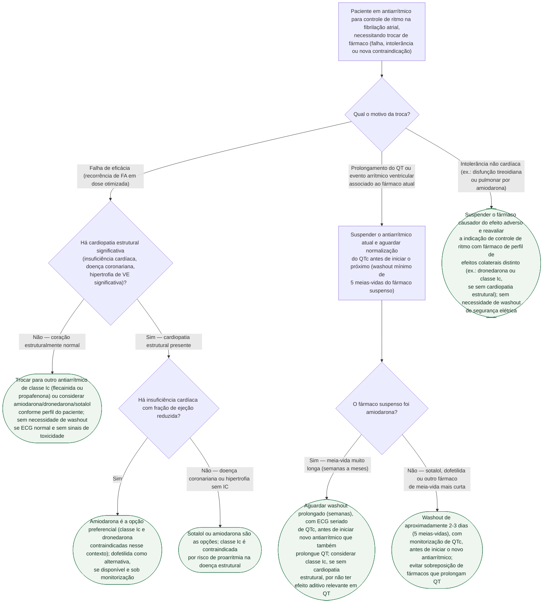

# Fluxograma: transição entre antiarrítmicos no controle de ritmo da fibrilação atrial

Trocar de antiarrítmico na fibrilação atrial não é só escolher o próximo da lista — o motivo da troca muda o caminho. Falha de eficácia em coração estruturalmente normal permite quase qualquer opção; falha em cardiopatia estrutural elimina a classe Ic por risco de proarritmia; e quando a troca é motivada por prolongamento de QT ou evento arrítmico, existe um período de washout obrigatório antes do próximo fármaco — e esse período muda de dias para semanas quando o fármaco suspenso é a amiodarona, pela meia-vida de eliminação extremamente longa.

## Árvore de decisão

## O que a árvore não mostra

- **Ablação por cateter pode ser preferível a uma segunda ou terceira tentativa de antiarrítmico**, especialmente após falha de um primeiro fármaco em paciente sintomático — as diretrizes atuais de FA rebaixaram o limiar para oferecer ablação mais cedo, e essa alternativa não aparece nesta árvore, que é só sobre escolha farmacológica.
- **"Pill-in-the-pocket" com flecainida ou propafenona** é uma estratégia à parte (cardioversão química ambulatorial para episódio paroxístico) e não uma "troca de antiarrítmico de manutenção" — não está contemplada aqui.
- **Ajuste de dose por função renal e hepática** é necessário para vários destes fármacos (sotalol e dofetilida por via renal, propafenona por via hepática) e não está detalhado nesta árvore, que trata apenas de qual classe escolher e do tempo de washout.
- **Síndromes arritmogênicas hereditárias (Brugada, QT longo congênito)** mudam completamente a lista de fármacos seguros e exigem avaliação eletrofisiológica especializada antes de qualquer troca — fora do escopo desta árvore, pensada para FA sem essas condições de base.
- **O tempo de 5 meias-vidas para washout é uma aproximação farmacocinética**, não uma regra fixa de segurança elétrica — em pacientes com função renal/hepática reduzida, a eliminação é mais lenta e o intervalo real de segurança pode ser maior do que o calculado pela meia-vida de bula.