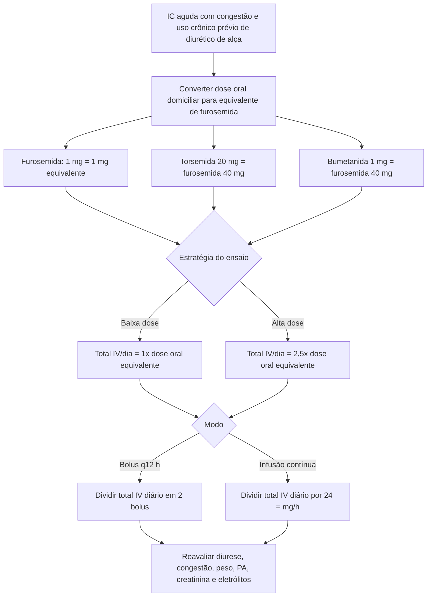

# Furosemida IV na IC aguda — metodologia do ensaio DOSE

Esta calculadora reproduz **a metodologia randomizada do ensaio DOSE**. Ela não define uma dose universal para todo paciente com insuficiência cardíaca aguda.

## População do DOSE

O ensaio randomizou 308 pacientes com insuficiência cardíaca aguda descompensada que:

- tinham história de IC crônica;
- usavam diurético de alça oral havia pelo menos 1 mês;
- recebiam dose equivalente de furosemida entre **80 e 240 mg/dia**.

Foram excluídos, entre outros, pacientes com PAS <90 mmHg, creatinina >3,0 mg/dL e aqueles que precisavam de vasodilatador ou inotrópico IV para IC.

## Estratégias comparadas

### Intensidade

- **Baixa dose:** total de furosemida IV/dia igual à dose oral domiciliar equivalente.
- **Alta dose:** total de furosemida IV/dia = **2,5 vezes** a dose oral equivalente.

### Forma de administração

- bolus IV a cada 12 horas;
- ou infusão IV contínua.

## Resultado principal

Não houve diferença significativa nos endpoints coprimários entre bolus e infusão contínua. A comparação alta versus baixa dose também não atingiu diferença significativa nos endpoints coprimários, embora a estratégia de alta dose tenha produzido maior diurese e tendências favoráveis em algumas medidas de sintomas/congestão.

A elevação transitória da creatinina >0,3 mg/dL foi mais frequente na estratégia de alta dose (**23% versus 14%**).

## Como a calculadora deve ser interpretada

O resultado significa:

> “Esta é a dose que reproduz este braço do ensaio DOSE para a dose domiciliar informada.”

Não significa:

> “Esta é obrigatoriamente a melhor dose para este paciente.”

Se o equivalente domiciliar informado estiver fora de **80–240 mg/dia de furosemida**, a calculadora mantém a aritmética, mas exibe alerta de que a extrapolação não reproduz diretamente a população estudada.

## Fonte

Felker GM, Lee KL, Bull DA, et al. Diuretic Strategies in Patients with Acute Decompensated Heart Failure. *N Engl J Med*. 2011;364:797–805. PMID **21366472**. DOI **10.1056/NEJMoa1005419**.
