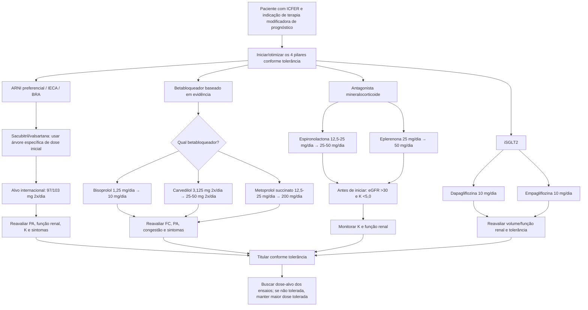

# ICFER — doses iniciais, doses-alvo e árvore dos quatro pilares

A diretriz AHA/ACC/HFSA orienta que as classes fundamentais da ICFER podem ser iniciadas **simultaneamente em baixas doses** ou sequencialmente conforme fatores clínicos. **Não é necessário atingir a dose-alvo de uma classe antes de iniciar outra.** Depois, cada fármaco deve ser titulado à dose-alvo dos ensaios clínicos conforme tolerância.

## Doses de referência

| Classe/fármaco | Dose inicial | Dose-alvo |
|---|---|---|
| Sacubitril/valsartana | 49/51 mg 2x/dia; pode iniciar 24/26 mg 2x/dia | 97/103 mg 2x/dia |
| Bisoprolol | 1,25 mg/dia | 10 mg/dia |
| Carvedilol | 3,125 mg 2x/dia | 25–50 mg 2x/dia |
| Metoprolol succinato CR/XL | 12,5–25 mg/dia | 200 mg/dia |
| Espironolactona | 12,5–25 mg/dia | 25–50 mg/dia |
| Eplerenona | 25 mg/dia | 50 mg/dia |
| Dapagliflozina | 10 mg/dia | 10 mg/dia |
| Empagliflozina | 10 mg/dia | 10 mg/dia |
| Ivabradina | 5 mg 2x/dia | 7,5 mg 2x/dia |
| Vericiguat | 2,5 mg/dia | 10 mg/dia |
| Digoxina | 0,125–0,25 mg/dia | individualizar para nível sérico 0,5 a <0,9 ng/mL |

## O que a tabela NÃO significa

- A dose-alvo não é autorização para titular diante de hipotensão, bradicardia, hipercalemia ou piora renal.
- O benefício não depende de “terminar” um pilar antes de começar outro. A diretriz aceita início simultâneo ou sequencial guiado pelo contexto.
- Para ARNI, a nomenclatura brasileira de Entresto 50/100/200 mg não é escrita da mesma forma que a tabela internacional 24/26, 49/51, 97/103 mg. Use a calculadora específica de **Entresto — bula Brasil** para seleção de dose inicial.

## MRA — bloqueios antes do início

A diretriz considera **eGFR ≤30 mL/min/1,73 m² ou K ≥5,0 mEq/L contraindicações para iniciar MRA**. Em eGFR 31–49, o texto de suporte orienta reduzir pela metade a dose de início/titulação. A Corvia terá calculadora própria para essa decisão, em vez de deixar a tabela de 25 mg ser aplicada automaticamente.

## Fonte

Heidenreich PA, Bozkurt B, Aguilar D, et al. 2022 AHA/ACC/HFSA Guideline for the Management of Heart Failure. *Circulation*. 2022;145:e895–e1032. DOI **10.1161/CIR.0000000000001063**.
