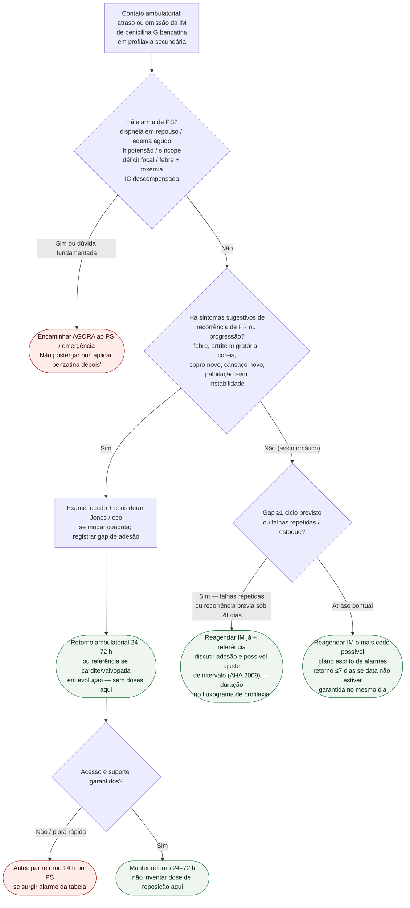

# Fluxograma ambulatorial: dose perdida de penicilina benzatina — destino

Prosa: [`sinalizadores-ambulatoriais-profilaxia-benzatina-dose-perdida-quando-agir`](sinalizadores-ambulatoriais-profilaxia-benzatina-dose-perdida-quando-agir.md). Checklist: [`checklist-ambulatorial-alarme-progressao-cardiopatia-reumatica`](checklist-ambulatorial-alarme-progressao-cardiopatia-reumatica.md). Duração/esquema: [`fluxograma-profilaxia-secundaria-febre-reumatica-duracao-e-esquema`](fluxograma-profilaxia-secundaria-febre-reumatica-duracao-e-esquema.md).

## Árvore de decisão

## Notas

- **D1** = gate de segurança (descompensação / embolia / toxemia).
- **D2** = suspeita de recorrência ou progressão ambulatorial → destino clínico precoce (ponte a Jones / WHF, não a doses).
- **D3** = adesão e sistema (OMS 2024 + Ralph 2017); intervalo AHA 2009 só como ponte ao especialista.
- Não decide UI, mg, intervalo-padrão nem duração por idade/gravidade.
