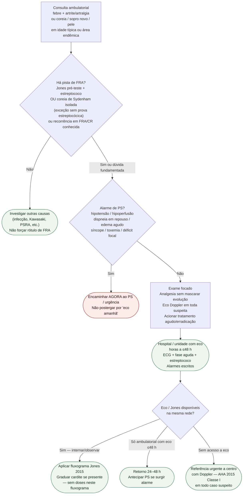

# Fluxograma ambulatorial: suspeita de FRA — destino hospitalar

Prosa: [sinalizadores-ambulatoriais-suspeita-febre-reumatica-aguda-quando-encaminhar](/biblioteca/sinalizadores-ambulatoriais-suspeita-febre-reumatica-aguda-quando-encaminhar). Checklist: [checklist-ambulatorial-alarme-cardite-suspeita-fra](/biblioteca/checklist-ambulatorial-alarme-cardite-suspeita-fra). Diagnóstico: [fluxograma-febre-reumatica-aguda-criterios-de-jones-2015](/biblioteca/fluxograma-febre-reumatica-aguda-criterios-de-jones-2015). Adesão benzatina (#850): [febre-reumatica-aguda-na-crianca-criterios-de-jones-2015-e-tratamento-da-fase-aguda](/biblioteca/febre-reumatica-aguda-na-crianca-criterios-de-jones-2015-e-tratamento-da-fase-aguda).

## Árvore de decisão

## Notas

- Coreia isolada pode ocorrer sem evidência estreptocócica; excluir alternativas e manter eco.
- [Tratamento agudo/erradicação](/biblioteca/febre-reumatica-aguda-na-crianca-criterios-de-jones-2015-e-tratamento-da-fase-aguda): não adiar somente porque confirmação está pendente; hemoculturas se febril sem atrasar emergência.

- **D0** = filtro de suspeita clínica (pré-teste), não diagnóstico Jones completo.
- **D1** = gate de segurança (IC / choque / toxemia / AVC).
- **D2** = ponte para Jones 2015 + eco (Gewitz Classe I) e, se cardite, graduação SBC — **sem** doses de profilaxia ou AINE aqui.
- Não decide UI, mg, intervalo de benzatina nem duração por categoria (ver #850 e fluxograma de profilaxia).
