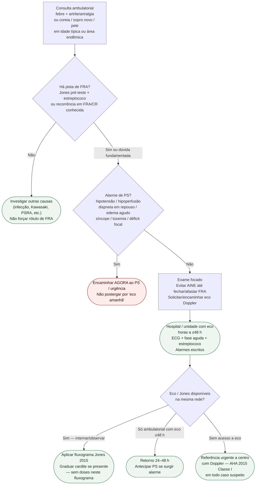

# Fluxograma ambulatorial: suspeita de FRA — destino hospitalar

Prosa: [`sinalizadores-ambulatoriais-suspeita-febre-reumatica-aguda-quando-encaminhar`](sinalizadores-ambulatoriais-suspeita-febre-reumatica-aguda-quando-encaminhar.md). Checklist: [`checklist-ambulatorial-alarme-cardite-suspeita-fra`](checklist-ambulatorial-alarme-cardite-suspeita-fra.md). Diagnóstico: [`fluxograma-febre-reumatica-aguda-criterios-de-jones-2015`](fluxograma-febre-reumatica-aguda-criterios-de-jones-2015.md). Adesão benzatina (#850): [`fluxograma-ambulatorial-dose-perdida-benzatina-destino`](fluxograma-ambulatorial-dose-perdida-benzatina-destino.md).

## Árvore de decisão

## Notas

- **D0** = filtro de suspeita clínica (pré-teste), não diagnóstico Jones completo.
- **D1** = gate de segurança (IC / choque / toxemia / AVC).
- **D2** = ponte para Jones 2015 + eco (Gewitz Classe I) e, se cardite, graduação SBC — **sem** doses de profilaxia ou AINE aqui.
- Não decide UI, mg, intervalo de benzatina nem duração por categoria (ver #850 e fluxograma de profilaxia).
