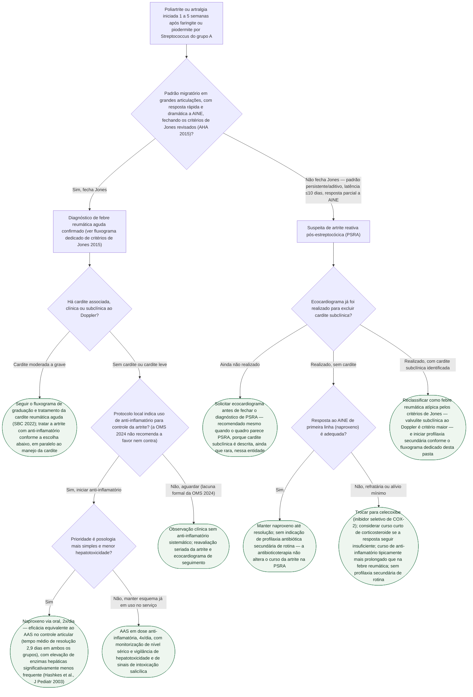

# Fluxograma: Artrite na Febre Reumática Aguda — Diagnóstico Diferencial com PSRA e Tratamento Anti-inflamatório

Este fluxograma parte de um cenário comum na prática: uma criança ou adolescente
chega com poliartrite ou poliartralgia semanas depois de uma faringite
estreptocócica, e a primeira pergunta não é "qual anti-inflamatório usar", é
"isto é febre reumática aguda ou é artrite reativa pós-estreptocócica (PSRA)?"
— porque a resposta muda ecocardiograma, profilaxia secundária e prognóstico
cardíaco. O diagnóstico de febre reumática em si (critérios de Jones revisados,
AHA 2015) já tem árvore própria nesta pasta; aqui a árvore assume que o quadro
articular já está caracterizado e decide o caminho a partir do padrão de
acometimento.

Duas ressalvas importantes, herdadas dos documentos-fonte:

- A diretriz da OMS 2024 **não recomenda a favor nem contra** o uso de
  anti-inflamatório na febre reumática aguda — declina a recomendação por
  insuficiência de evidência. O ramo de tratamento anti-inflamatório deste
  fluxograma pressupõe que a decisão de tratar já foi tomada por protocolo
  local, não que ela seja obrigatória.
- O ensaio que compara naproxeno e AAS (Hashkes et al., 2003) é pequeno (33
  pacientes) e não substitui uma diretriz robusta — é a melhor evidência
  comparativa direta disponível entre os dois agentes, não uma recomendação de
  classe.

## Árvore de decisão

## Notas de leitura

- **A troca de classe de AINE na PSRA (naproxeno → celecoxibe) e o corticosteroide
  complementar vêm de relato de caso, não de ensaio clínico randomizado** — onde a
  diretriz formal (ESC/AHA/SBC) não define esquema específico para PSRA, isso é
  `VERIFICAÇÃO HUMANA NECESSÁRIA` antes de virar protocolo institucional, exatamente
  como já registrado no documento de origem desta árvore.
- **A decisão sobre profilaxia secundária em casos-limite é zona cinzenta
  reconhecida na literatura** — mesmo com PSRA confirmada sem cardite, alguns
  serviços optam por profilaxia "por precaução" diante de incerteza diagnóstica
  real. Este fluxograma segue a recomendação formal (sem profilaxia de rotina em
  PSRA), mas essa prática variável está descrita no documento-fonte.
- Este fluxograma **não repete** a árvore diagnóstica completa dos critérios de
  Jones nem a graduação de gravidade da cardite — cada uma já tem fluxograma
  próprio nesta pasta, referenciado nos nós correspondentes.
