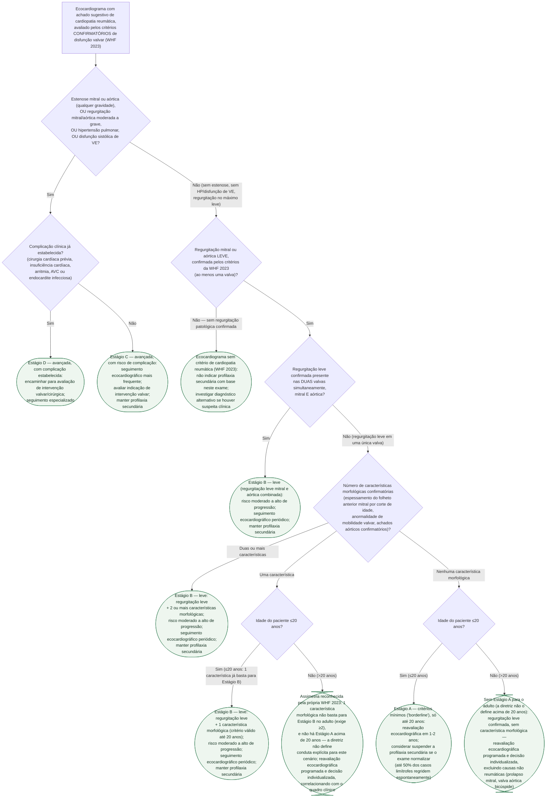

# Fluxograma: Cardiopatia Reumática Subclínica — Estadiamento Ecocardiográfico A-D e Seguimento (WHF 2023)

## Definição
Este fluxograma organiza a decisão de **estadiamento e seguimento** de um achado ecocardiográfico já avaliado pelos critérios **CONFIRMATÓRIOS** da World Heart Federation (WHF) 2023 — a etapa que vem **depois** do rastreamento, quando se decide em que estágio A-D o paciente se encontra e qual o intervalo de reavaliação. É um recorte diferente dos cinco fluxogramas já publicados nesta pasta: eles cobrem o diagnóstico da febre reumática aguda (critérios de Jones), a graduação e o tratamento da cardite na fase aguda, o diagnóstico diferencial de artrite/PSRA, a duração da profilaxia secundária e a decisão de intervenção na valvopatia mitral **crônica já estabelecida**. Aqui a pergunta é anterior a todas essas: **este achado ecocardiográfico é cardiopatia reumática subclínica, em que estágio, e com que conduta de seguimento?**

A nomenclatura antiga ("borderline", "definite", "latente") foi aposentada pela WHF 2023 em favor do estadiamento A-D, e essa troca não é só de rótulo: o **estágio A carrega conduta própria** (reavaliação em 1-2 anos, com possibilidade de suspender a profilaxia se o exame normalizar) que o termo "borderline" nunca teve associada de forma padronizada.

## Dois pontos que a árvore assume como já resolvidos, e por quê
- **Critérios confirmatórios, não de rastreio.** A WHF 2023 separa critérios de rastreamento (para busca ativa, até 20 anos) dos confirmatórios (para o especialista, qualquer idade). Este fluxograma parte do zero já usando os confirmatórios — velocidade ≥3,0 m/s, jato pansistólico/pandiastólico, gradiente ≥4,0 mmHg na estenose — porque é isso que autoriza estadiamento.
- **Excluir causas não reumáticas de regurgitação leve já é pré-requisito da própria diretriz** — sobretudo prolapso de valva mitral e valva aórtica bicúspide — antes de aplicar qualquer ramo desta árvore.

## Duas assimetrias que a própria diretriz reconhece, e que a árvore não esconde
A diretriz é explícita: **o estágio A simplesmente não existe para o adulto** (só se aplica até 20 anos), e o número de características morfológicas exigido para o estágio B é **assimétrico por idade** — 1 característica basta até 20 anos, mas são exigidas **2** acima de 20 anos. Isso deixa dois cenários sem estágio formal definido pela diretriz: adulto com regurgitação leve confirmada e **zero** características morfológicas, e adulto com regurgitação leve confirmada e **apenas 1** característica. A árvore termina esses dois ramos com a conduta honesta — reavaliação programada e decisão clínica individualizada — em vez de inventar um corte que a fonte não define.

## Números que sustentam a conduta de reavaliar em vez de intervir no estágio A/B
A própria diretriz registra que **até 50% dos casos limítrofes (estágio A) e 30% dos casos leves regridem espontaneamente** — é o que justifica reavaliar em 1-2 anos em vez de tratar agressivamente um achado inicial mínimo, e é também o que justifica considerar suspender a profilaxia secundária se o exame normalizar nesse intervalo.

## Árvore de decisão

## Armadilhas clínicas
- **Laudar "cardiopatia reumática limítrofe" ou "definitiva".** A nomenclatura foi aposentada pela WHF 2023; o estágio A carrega conduta própria (reavaliação programada, possibilidade de suspender profilaxia) que o termo antigo não tinha associada de forma padronizada.
- **Aplicar os critérios de RASTREAMENTO no adulto.** Acima de 20 anos a diretriz exige os critérios CONFIRMATÓRIOS — a evidência do rastreio nessa faixa etária é limitada, e é a partir dos confirmatórios que esta árvore de estadiamento começa.
- **Assumir que existe Estágio A no adulto.** Não existe — é uma assimetria explícita da própria diretriz, não uma omissão deste fluxograma.
- **Usar o mesmo corte de característica morfológica em qualquer idade.** É assimétrico: 1 característica basta até 20 anos, são exigidas 2 acima de 20 anos.
- **Tratar achado de estágio A/B como indicação de intervenção.** Não é — a conduta nos estágios A e B é seguimento ecocardiográfico periódico e manutenção/consideração de suspensão da profilaxia secundária, não intervenção valvar. Intervenção entra na conversa a partir do estágio C.
- **Esquecer de excluir prolapso de valva mitral e valva aórtica bicúspide** antes de rotular uma regurgitação leve como reumática — pré-requisito da própria diretriz.
- **Ignorar que boa parte dos achados iniciais regride espontaneamente.** Até 50% dos casos limítrofes e 30% dos leves — é o que justifica reavaliar antes de escalonar conduta.
