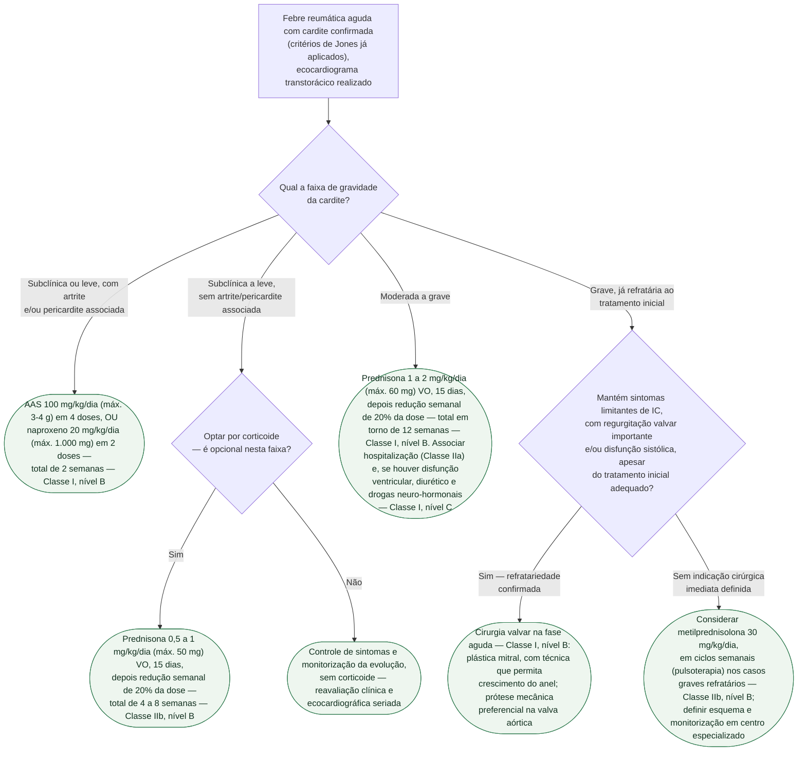

# Fluxograma: Cardite reumática aguda — graduação de gravidade e conduta terapêutica (SBC 2022)

Este fluxograma pressupõe diagnóstico já fechado — critérios de Jones
revisados de 2015, cobertos no outro fluxograma deste tema — e a cardite já
caracterizada como manifestação maior. O que ele decide é **o que fazer**, a
partir de uma graduação cumulativa em quatro faixas (subclínica, leve,
moderada, grave), que é o eixo central da Tabela 40 da diretriz brasileira de
2022. A cardite reumática é uma pancardite, mas a manifestação dominante é
valvar — **valvulite aguda em 90% dos casos** —, e é por isso que a gravidade
se apoia tanto no achado clínico quanto na regurgitação valvar ao eco.

## Árvore de decisão

## O que vale para todo ramo, e por isso não está na árvore

**Erradicação estreptocócica é Classe I, nível C, para todo paciente com
cardite reumática**, independentemente da faixa de gravidade — mesmo quando o
quadro é interpretado como resposta imune tardia à infecção, não infecção
ativa no momento: penicilina G benzatina IM em dose única (1.200.000 UI se
20 kg ou mais; 600.000 UI se menos de 20 kg), ou amoxicilina 50 mg/kg/dia
(máx. 1.500 mg) em 3 doses por 10 dias; eritromicina 40 mg/kg/dia
(máx. 1.000 mg) em 4 doses por 10 dias no alérgico à penicilina. É a dose que
erradica o episódio agudo — a profilaxia secundária que se segue, com a
mesma penicilina em intervalo repetido, é decisão à parte, coberta em
documento próprio deste tema.

**Repouso é Classe IIa, nível C, no caso moderado ou grave** — recomendação
que acompanha qualquer conduta farmacológica escolhida nessas duas faixas,
não é alternativa a ela.

## O que a árvore não mostra

**A tensão interna da própria diretriz sobre corticoide na forma leve.** O
texto corrido diz que a forma subclínica/leve "implica controle dos sintomas
e monitoramento da evolução", e que só a forma moderada/grave "implica uso de
corticosteroides" — mas a Tabela 40 traz uma linha de prednisona para o caso
subclínico a leve, ainda que como Classe IIb. A leitura que concilia as duas
partes do texto é a que a árvore usa: corticoide não é rotina na forma leve,
é opção — e quem decidir isso à beira do leito deve conferir o texto integral
da diretriz, não só este resumo.

**Troponina normal não afasta cardite reumática.** O dano miocárdico costuma
ser pequeno nessa doença, por isso a troponina como critério diagnóstico é
apenas Classe IIb, nível B — não é exame usado para graduar gravidade nesta
árvore.

**Cintilografia com Gálio-67 é o exame de imagem de escolha quando a
investigação etiológica precisa ir além do ecocardiograma** (Classe IIa,
nível B) — a ressonância cardíaca é Classe IIb aqui, ao contrário do peso que
tem na miocardite viral, porque a diretriz reconhece que faltam trabalhos
específicos para febre reumática e que o acometimento é prioritariamente
valvar, não miocárdico.

**Miocardite reumática propriamente dita** — insuficiência cardíaca manifesta
sem valvopatia aguda anatomicamente importante — deve levar a investigar
diagnósticos diferenciais de miocardite antes de tratar como cardite
reumática típica; este fluxograma pressupõe que a valvulite já esteja
caracterizada.

**Cerca de metade dos casos de cardite aguda evolui para cardiopatia
reumática crônica** (tipicamente valvopatia mitral e/ou aórtica) — o
seguimento dessa evolução, e a decisão entre reparo e substituição valvar na
doença já estabelecida, têm documento próprio nesta pasta e não estão
cobertos aqui.
