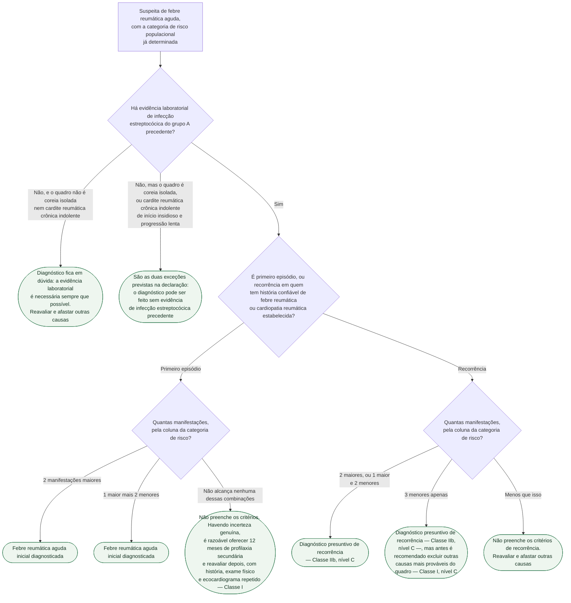
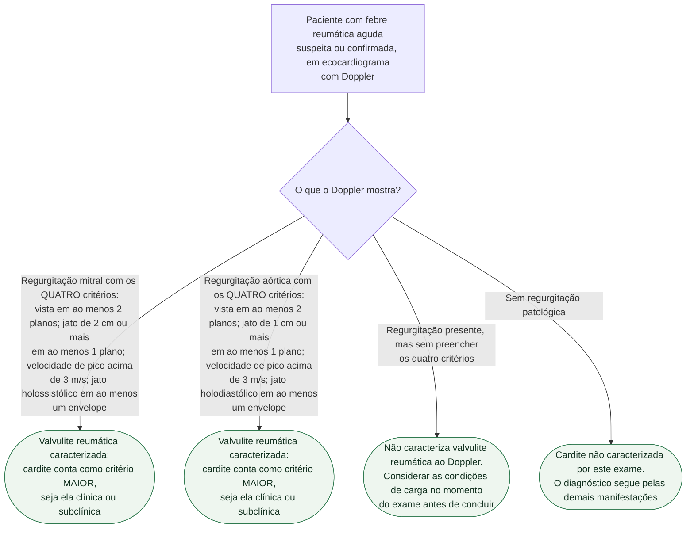

# Fluxograma: Febre reumática aguda — critérios de Jones revisados (AHA 2015) e cardite ao Doppler

A revisão de 2015 mudou duas coisas de fundo nos critérios de Jones, e as duas
mexem na conta que se faz à beira do leito.

**Primeira: não existe mais um único conjunto de critérios.** Antes de contar
manifestação maior e menor, é preciso saber em que **categoria de risco
populacional** o paciente está. Os limiares de febre, de VHS e a própria lista de
manifestações mudam entre as duas colunas. Aplicar a coluna errada gera
subdiagnóstico em população de alto risco — que foi exatamente o problema que a
revisão veio resolver.

**Segunda: a cardite deixou de ser achado exclusivamente clínico.** A valvulite
**subclínica**, detectada só ao Doppler em paciente sem sopro, passou a valer como
critério maior, nas duas categorias de risco. Mas com uma exigência que o
fluxograma abaixo torna difícil de ignorar: os **quatro** critérios Doppler
precisam estar presentes, não dois ou três.

## A categoria de risco, que vem antes de tudo

**Baixo risco** exige dado epidemiológico confiável: incidência de febre reumática
aguda de até 2 por 100.000 crianças em idade escolar (geralmente de 5 a 14 anos)
por ano, **ou** prevalência de cardiopatia reumática, em todas as idades, de até
1 por 1.000 habitantes por ano — recomendação **Classe IIa, nível C**.

A regra para todo o resto é explícita e é **Classe I, nível C**: *criança que não
seja claramente de população de baixo risco está em risco moderado a alto*. Ou
seja, na ausência do dado epidemiológico que comprove o baixo risco, a coluna que
se aplica é a de risco moderado a alto — a classificação não é geográfica nem por
impressão, e a falta de dado não classifica ninguém como de baixo risco.

## Manifestações maiores e menores, por categoria

| | População de baixo risco | População de risco moderado a alto |
|---|---|---|
| **Maiores** | cardite, clínica e/ou subclínica; **poliartrite apenas**; coreia; eritema marginado; nódulos subcutâneos | cardite, clínica e/ou subclínica; **monoartrite ou poliartrite**; **poliartralgia**; coreia; eritema marginado; nódulos subcutâneos |
| **Menores** | **poliartralgia**; febre a partir de 38,5 °C; VHS de 60 mm ou mais na primeira hora e/ou PCR de 3,0 mg/dL ou mais; intervalo PR prolongado para a idade, exceto quando a cardite já é critério maior | **monoartralgia**; febre a partir de 38 °C; VHS de 30 mm/h ou mais e/ou PCR de 3,0 mg/dL ou mais; intervalo PR prolongado para a idade, exceto quando a cardite já é critério maior |

Três regras de contagem que evitam erro:

- **Manifestação articular entra em uma categoria só.** Se a artrite foi usada
  como critério maior, a artralgia não pode ser contada também como menor no mesmo
  paciente.
- **Poliartralgia só vale como critério maior** em população de risco moderado a
  alto, e ainda assim **depois de afastadas outras causas**.
- **Eritema marginado e nódulos subcutâneos raramente aparecem isolados** — como
  nas versões anteriores dos critérios, quase nunca são o único achado maior.
- O valor de **PCR precisa estar acima do limite superior do laboratório**, e o
  de **VHS deve ser o valor de pico**, porque a VHS evolui ao longo do quadro.

## Árvore de decisão: diagnóstico

## Árvore de decisão: cardite ao Doppler

Repare na assimetria entre as duas valvas: o **comprimento mínimo do jato é de
2 cm na mitral e de 1 cm na aórtica**. É a única diferença numérica entre os dois
conjuntos — os outros três critérios são iguais, trocando holossistólico por
holodiastólico.

## O que as árvores não mostram

**Frequência das manifestações maiores no primeiro episódio**, útil para calibrar
a suspeita: cardite em 50 a 70% e artrite em 35 a 66% dos casos; depois coreia,
em 10 a 30%, com predomínio no sexo feminino; e, bem menos comuns porém muito
específicos, nódulos subcutâneos em 0 a 10% e eritema marginado em menos de 6%.

**Achados inespecíficos que acompanham, mas não contam**: taquicardia
desproporcional à febre, mal-estar, anemia, leucocitose, epistaxe e dor
precordial. São compatíveis com o quadro, aparecem em muitas outras doenças e não
entram na contagem. História familiar de febre reumática também não é critério —
apenas aumenta a suspeita.

**Profilaxia secundária, sua duração e o manejo da valvopatia estabelecida** têm
documentos próprios nesta biblioteca. Este fluxograma cobre o diagnóstico do
episódio agudo e a caracterização da cardite, que é onde a revisão de 2015
mexeu.

**"Febre reumática possível" continua existindo.** Em cenário de alta incidência
onde faltam prova de fase aguda, confirmação de infecção estreptocócica ou
história confiável, a declaração é explícita ao pedir que o clínico use seu
julgamento — e é dali que sai a conduta de oferecer 12 meses de profilaxia
secundária com reavaliação, que aparece na primeira árvore.
