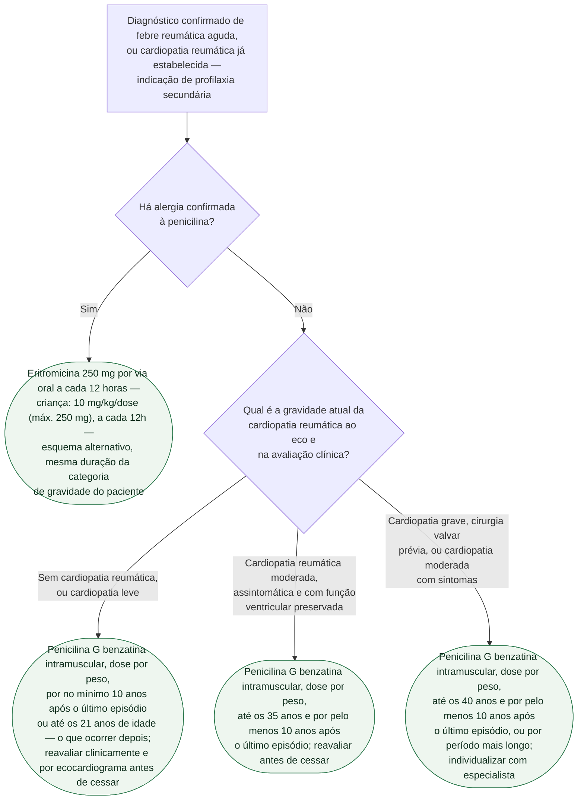

# Fluxograma: Profilaxia secundária da febre reumática — escolha do antibiótico e duração por gravidade

A profilaxia antibiótica secundária é a intervenção isolada mais eficaz para
evitar recorrência da febre reumática — e é a recorrência, não o episódio
índice, o principal mecanismo de agravamento progressivo do dano valvar
reumático. Uma vez fechado o diagnóstico do episódio agudo (fluxograma dos
critérios de Jones, já publicado neste tema), duas perguntas organizam a
receita: **há alergia à penicilina** e **qual é a gravidade atual da
cardiopatia reumática**, documentada clínica e ecocardiograficamente. A duração
não deve ser inferida apenas pela intensidade da cardite no episódio agudo.

## Árvore de decisão

## A dose por peso e o intervalo, que não são ramos da árvore

**Dose de penicilina G benzatina, igual nas três durações**: 1.200.000 UI
(cerca de 900 mg) por via intramuscular profunda em dose única, em quem pesa
20 kg ou mais; 600.000 UI (cerca de 450 mg) em quem pesa menos de 20 kg. É a
mesma dose usada para tratar o episódio agudo (erradicação estreptocócica),
mas aqui administrada repetidamente, não uma única vez — não confundir as
duas indicações.

**Intervalo padrão: a cada 28 dias.** Mas a declaração científica da AHA de
2009 é explícita: em **população de alta incidência de febre reumática**, ou
em paciente que **recorreu apesar de já estar em uso do esquema de 28 dias**,
encurtar o intervalo para **21 dias** é justificado — o nível sérico
protetor de penicilina pode cair abaixo do limiar de proteção antes de
completar a quarta semana. Esse ajuste de intervalo é ortogonal à duração
total do tratamento (que segue definida pela gravidade, coluna acima): um
paciente pode estar na faixa "até os 35 anos" e, dentro dela, receber a dose
a cada 21 dias em vez de 28.

**A eritromicina segue a mesma duração por gravidade** do esquema com
penicilina — a alergia muda o fármaco, não o prazo de manutenção.

**A classificação usada para definir a duração é a cardiopatia reumática
atual, não uma lembrança da gravidade da cardite aguda.** Antes de interromper
a profilaxia, é necessária reavaliação clínica e ecocardiográfica, além de
considerar exposição futura ao estreptococo e tempo desde o último surto.

## O que a árvore não mostra

**Reação adversa grave à penicilina benzatina é rara, mas descrita**,
sobretudo em paciente com doença valvar já grave — a via intramuscular
recorrente e a logística de reaplicação a cada 3-4 semanas são, na prática,
os maiores obstáculos à adesão de longo prazo, mais do que o efeito adverso
em si.

**Erradicação do episódio agudo é dose única, não profilaxia.** O tratamento
antibiótico do surto agudo de febre reumática (mesma penicilina G benzatina,
mesma dose por peso, mas administrada uma única vez para erradicar o
estreptococo do grupo A) é etapa distinta, coberta no documento de graduação
e tratamento da cardite reumática aguda desta pasta — a profilaxia secundária
começa depois, e é ela que se repete indefinidamente pelo prazo definido
acima.

**"O que ocorrer depois" pode prolongar o tratamento além dos 21 anos.** Um paciente que
teve o primeiro episódio aos 25 anos, sem cardite, já ultrapassou os 21 anos
de idade — nesse caso vale a regra dos 10 anos após o episódio, e não a idade
cronológica, porque a instrução manda usar o que vier **depois** dos dois
critérios, não o primeiro que se cumprir.

**Populações de alta incidência concentram a maior parte da carga global de
febre reumática**, e é justamente nelas que interrupções no fornecimento de
penicilina benzatina e a dificuldade logística da aplicação intramuscular
recorrente mais comprometem a adesão de longo prazo — um problema de sistema
de saúde, não só de prescrição individual.
