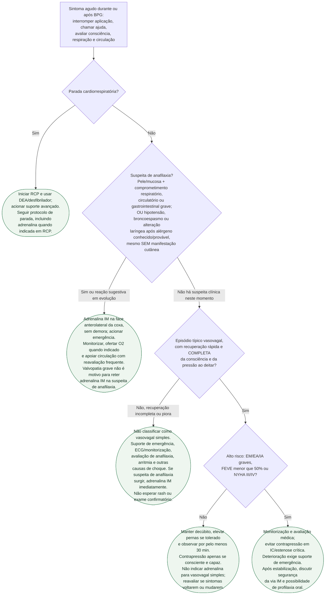

# Fluxograma: Reação Aguda à Penicilina Benzatina na Cardiopatia Reumática — Diferenciação e Conduta

A prioridade é reconhecer comprometimento de via aérea, respiração e circulação. **Ausência de urticária não exclui anafilaxia; urticária isolada não a confirma.** Os padrões vasovagais da AHA 2022 auxiliam a avaliação, mas não substituem os critérios clínicos e o tratamento precoce descritos pela WAO 2020.

## Árvore de decisão

## Adrenalina e reconhecimento clínico

Na suspeita de anafilaxia, a dose profissional é **0,01 mg/kg IM, máximo 0,5 mg por dose**, usando solução de **1 mg/mL**, na face anterolateral da coxa. Repetir em **5–15 min** se necessário, com monitorização e suporte. A via intravenosa em bolus não é o tratamento inicial da anafilaxia e traz risco de arritmia; infusão para anafilaxia refratária exige equipe experiente e ambiente monitorizado. Na parada cardíaca, segue-se o protocolo próprio de RCP.

Os critérios auxiliam o diagnóstico, sem exigir espera por todos os sinais. Comprometimento circulatório após alérgeno altamente provável pode ser anafilaxia mesmo sem urticária ou broncoespasmo. Não aguardar confirmação de Brighton, triptase ou resposta a medidas posturais para iniciar adrenalina quando a suspeita já existe.

Urticária isolada, com respiração e circulação preservadas, requer avaliação e observação de possível evolução, mas não é automaticamente anafilaxia. Pulso carotídeo palpável e melhora parcial ao deitar também não a excluem.

## Cuidados com a posição e a observação

Manter posição segura, ajustada à respiração e ao nível de consciência; não permitir levantar ou caminhar durante instabilidade. Decúbito costuma ser adequado, mas dispneia intensa ou inconsciência exigem posicionamento e proteção de via aérea apropriados. Reposição de volume deve ser individualizada, sobretudo na cardiopatia com congestão.

Os **30 min** correspondem à observação de rotina após BPG e não a uma regra de alta após anafilaxia, choque ou reação prolongada. Esses quadros exigem observação e atendimento conforme gravidade, resposta e risco de recorrência.

A estratificação cardíaca deve ocorrer antes da aplicação. O alto risco muda a prevenção e o nível de suporte necessário; não altera a indicação de adrenalina IM quando há suspeita de anafilaxia.

## Tudo com Tudo

- [Segurança da Penicilina Benzatina na Cardiopatia Reumática Grave: Diferenciando Reação Alérgica, Resposta Vasovagal e Comprometimento Cardiovascular](/biblioteca/seguranca-da-penicilina-benzatina-na-cardiopatia-reumatica-grave-alergia-vasovagal-ou-comprometimento-cardiovascular) — Síntese clínica completa da qual esta árvore deriva, com a tabela de diferenciação e a estratificação de risco na íntegra.
- [Fluxograma: Profilaxia secundária da febre reumática — escolha do antibiótico e duração por gravidade](/biblioteca/fluxograma-profilaxia-secundaria-febre-reumatica-duracao-e-esquema) — Decisão pré-injeção entre via intramuscular e oral, que D3 nesta árvore pressupõe já ter sido considerada.
- [Fluxograma: síncope reflexa versus cardíaca — diagnóstico diferencial](/biblioteca/fluxograma-sincope-reflexa-versus-cardiaca-diagnostico-diferencial) — Amplia a avaliação de síncope fora do contexto de injeção; não substitui os critérios de anafilaxia.
- [Síndrome de Kounis: síndrome coronariana aguda alérgica](/biblioteca/sindrome-de-kounis-sindrome-coronariana-aguda-alergica) — Diagnóstico diferencial a considerar na folha C2, quando o padrão não se encaixa integralmente em vasovagal nem em anafilaxia clássica.
- [Epinefrina (adrenalina)](/biblioteca/epinefrina-adrenalina) — Tratamento de primeira linha quando há suspeita de anafilaxia, inclusive com doença valvar grave.
