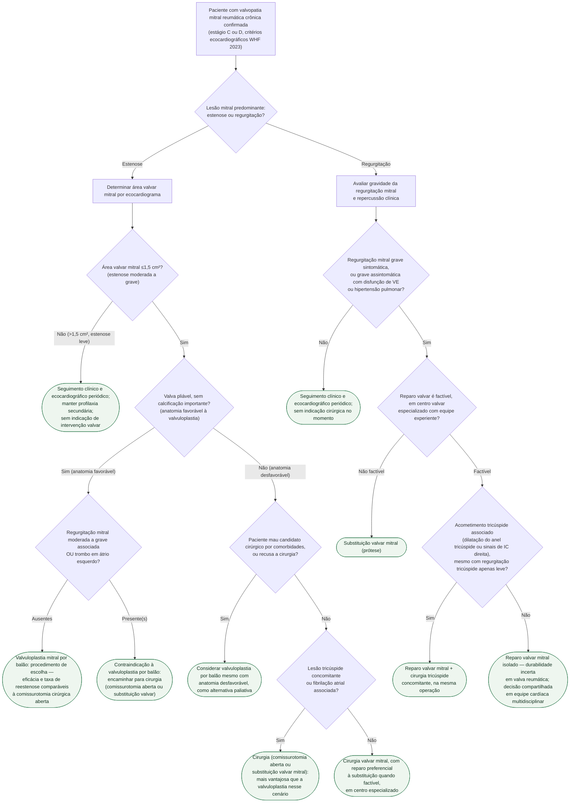

# Fluxograma: Valvopatia Mitral Reumática Crônica — Quando e Como Intervir

## Definição
Este fluxograma organiza a decisão de intervenção na valvopatia mitral reumática **crônica** já estabelecida (estágios C/D da classificação ecocardiográfica da World Heart Federation, 2023) — um recorte diferente dos três fluxogramas já publicados nesta pasta, que cobrem os critérios diagnósticos da febre reumática aguda (Jones 2015), a graduação e o tratamento da cardite na fase aguda, e a duração da profilaxia antibiótica secundária. Aqui a pergunta é outra: **a valva mitral já está estruturalmente doente — quando intervir, e por qual via?**

A árvore separa as duas lesões mitrais predominantes da doença reumática crônica — **estenose** e **regurgitação** —, porque a via de decisão e as opções terapêuticas são diferentes em cada uma: a estenose tem uma alternativa percutânea consolidada (valvuloplastia por balão) que a regurgitação não tem; a regurgitação decide primariamente entre reparo e substituição cirúrgica, escolha que na doença reumática **não** segue a mesma régua da doença mitral degenerativa.

## Estenose mitral: valvuloplastia por balão ou cirurgia
- **Corte de gravidade**: área valvar mitral **>1,5 cm²** é estenose leve; **≤1,5 cm²** é estenose moderada a grave — o corte que orienta a decisão de intervir.
- **Valvuloplastia por balão** é o procedimento de escolha na estenose grave com **anatomia favorável** (valva pliável, sem calcificação importante) — alternativa validada à comissurotomia cirúrgica aberta, com eficácia e taxa de reestenose comparáveis, por vezes superiores, num ensaio clássico randomizado (NEJM, comissurotomia aberta vs. valvuloplastia por balão).
- **Contraindicações à valvuloplastia**, conferidas no texto integral do StatPearls: **regurgitação mitral moderada a grave associada**, **valva calcificada** e **trombo em átrio esquerdo** — presente qualquer uma delas, o caminho é cirúrgico.
- **Anatomia desfavorável não é contraindicação absoluta**: pode-se considerar valvuloplastia mesmo assim em paciente mau candidato cirúrgico por comorbidade, ou que recuse a cirurgia — alternativa paliativa, não de primeira escolha.
- **Quando a cirurgia é preferível mesmo com anatomia favorável para valvuloplastia**: lesão tricúspide concomitante ou fibrilação atrial associada — nesses cenários a cirurgia oferece área de abertura valvar pós-operatória maior e resolve a lesão associada na mesma operação.

## Regurgitação mitral: reparo ou substituição
- **Indicação de intervenção**: regurgitação grave sintomática, ou grave assintomática com disfunção de ventrículo esquerdo ou hipertensão pulmonar — mesmo racional geral de indicação cirúrgica em valvopatia mitral, aplicado à etiologia reumática.
- **Reparo é a meta, mas com uma ressalva que diferencia a doença reumática da degenerativa**: diretrizes recomendam reparo sempre que factível, e mesmo assim **a superioridade de sobrevida do reparo sobre a substituição, bem estabelecida na doença mitral degenerativa, não está demonstrada na doença reumática** — estudos mostram desfechos semelhantes entre reparo e substituição em mortalidade operatória, morbidade e sobrevida de longo prazo na valva reumática, provavelmente porque a doença reumática é menos passível de reparo durável e exige técnicas mais complexas.
- **Centro especializado**: o reparo mitral reumático deve ser considerado apenas em centro valvar abrangente, por equipe experiente — não é procedimento de rotina em qualquer serviço.
- **Acometimento tricúspide associado**: frequente na doença reumática multivalvar. Cirurgia tricúspide concomitante é indicada durante a cirurgia de valva esquerda **mesmo com regurgitação tricúspide apenas leve**, na presença de dilatação do anel tricúspide ou sinais de insuficiência cardíaca direita — previne progressão da lesão tricúspide sem aumentar o risco operatório.
- **Decisão multidisciplinar**: por causa da incerteza sobre durabilidade do reparo e do acometimento multivalvar frequente, a discussão em equipe cardíaca é parte da conduta, não um adendo.

## Árvore de decisão

## Armadilhas clínicas
- **Tratar anatomia desfavorável como contraindicação absoluta à valvuloplastia.** Não é: em mau candidato cirúrgico ou paciente que recusa cirurgia, a valvuloplastia por balão pode ser tentada mesmo com anatomia menos favorável, como alternativa paliativa.
- **Assumir que o reparo é sempre superior à substituição na valva mitral reumática**, extrapolando a régua da doença degenerativa. Na doença reumática os desfechos comparativos de reparo e substituição são semelhantes — a superioridade do reparo não está demonstrada aqui como está na degenerativa.
- **Ignorar a valva tricúspide.** Acometimento tricúspide é frequente na doença mitral reumática associada a doença aórtica, e negligenciar sua função pode aumentar morbidade e levar a reoperação — cirurgia tricúspide concomitante é indicada mesmo com regurgitação tricúspide apenas leve, na presença de dilatação anular ou sinais de IC direita.
- **Indicar valvuloplastia por balão sem excluir trombo em átrio esquerdo e regurgitação mitral moderada a grave associada** — as duas são contraindicação ao procedimento, não apenas um detalhe de anatomia.
- **Operar valva mitral reumática fora de centro especializado** partindo do princípio de que "é só uma comissurotomia" — o próprio racional de reparo em doença reumática depende de equipe experiente em centro valvar abrangente, por ser tecnicamente mais complexo que o reparo da valva degenerativa.
