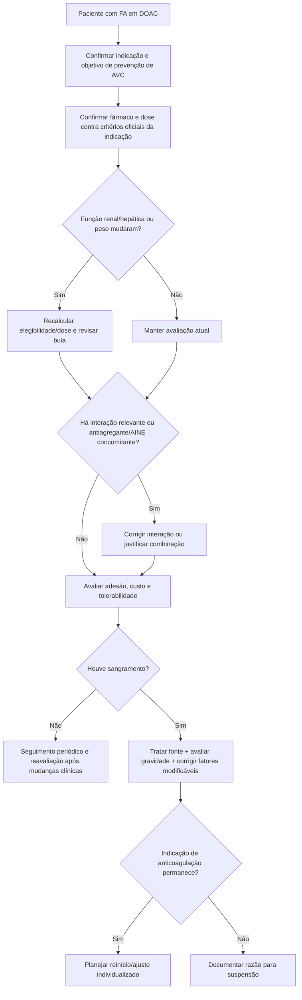

# ACC 2026 — DOACs na prática

O Scientific Statement ACC de 2026 sobre anticoagulantes orais diretos (DOACs) parte de um problema de implementação: apesar de ampla evidência de eficácia e segurança, esses medicamentos ainda são **subutilizados e frequentemente prescritos em dose inadequada**, especialmente em pacientes de maior risco trombótico ou com comorbidades.

O documento cobre prevenção e tratamento de trombose, mas para fibrilação atrial a mensagem central é que prescrever um DOAC corretamente exige revisar **indicação, dose, rim, fígado, interações, adesão, sangramento e procedimentos** ao longo do tempo.

## 1. Não existe “dose de DOAC para idoso”

Reduzir empiricamente a dose apenas porque o paciente é idoso, frágil ou tem medo de sangramento pode diminuir eficácia sem oferecer o benefício esperado.

A dose deve seguir os critérios específicos do fármaco e da indicação, considerando:

- função renal;
- idade e peso quando fazem parte do critério oficial;
- interações farmacológicas;
- indicação clínica;
- critérios da bula/estudos pivotais.

**Doses específicas não são reproduzidas neste documento:** consultar calculadora/bula vigente correspondente.

## 2. Função renal deve ser reavaliada

DRC não é automaticamente contraindicação a DOAC, mas modifica escolha, dose e frequência de acompanhamento.

Reavaliar especialmente quando houver:

- piora de creatinina;
- desidratação;
- internação;
- introdução de diurético intenso;
- infecção grave;
- grande perda de peso;
- mudança clínica que possa alterar depuração.

A equação usada para ajuste deve ser a que corresponde à bula/estudo do fármaco, evitando trocar silenciosamente métodos de estimativa renal.

## 3. Doença hepática, obesidade e fragilidade

O statement discute cenários em que a evidência é menos uniforme:

- hepatopatia;
- extremos de peso/obesidade;
- fragilidade;
- história de sangramento;
- câncer;
- polifarmácia.

Essas condições pedem individualização, não abandono automático do DOAC.

## 4. Interações são causa evitável de falha

Revisar:

- inibidores/indutores relevantes de CYP/P-gp quando aplicável;
- antiagregantes;
- AINEs;
- outros fármacos que elevem risco hemorrágico;
- adesão e custo.

Uma prescrição farmacologicamente correta pode falhar se o paciente não consegue adquirir ou tomar o medicamento de forma regular.

## 5. Sangramento não encerra automaticamente a anticoagulação

Após sangramento, responder sequencialmente:

1. qual foi a gravidade e o local?
2. a fonte foi tratada?
3. ainda existe indicação tromboembólica relevante?
4. há fatores modificáveis como PA, AINE, antiagregante, função renal ou dose inadequada?
5. quando e como reiniciar é mais seguro?

A interrupção definitiva sem reavaliar o risco de AVC pode causar dano evitável.

## 6. Após ablação de FA ou fechamento do apêndice atrial

O statement inclui recomendações para anticoagulação após ablação de FA e após fechamento do apêndice atrial esquerdo, áreas em rápida evolução. Estudos recentes como OCEAN devem ser lidos em conjunto com risco tromboembólico basal, tipo de procedimento e recomendações atualizadas — não como autorização universal para interromper anticoagulação.

## Árvore de decisão — revisão de DOAC em FA

## Checklist mínimo a cada revisão

- indicação continua presente?
- dose corresponde à bula atual?
- função renal foi atualizada?
- peso/idade alteraram critério de dose?
- há novo fármaco com interação?
- há AAS/P2Y12 sem indicação atual?
- houve sangramento ou anemia?
- paciente está tomando todas as doses?
- custo ou dificuldade de acesso estão levando a omissões?
- há procedimento planejado?

## Armadilhas

- Subdose “por segurança” sem critério formal.
- Manter dose antiga após deterioração renal importante.
- Esquecer antiagregante indefinidamente após a indicação ter expirado.
- Interpretar fragilidade como contraindicação automática à anticoagulação.
- Suspender definitivamente após sangramento tratável sem reavaliar risco de AVC.
- Considerar adesão apenas como comportamento do paciente, ignorando custo e acesso.

## Regra prática

**DOAC não é prescrição de uma vez só.** A qualidade da anticoagulação depende de revalidar periodicamente indicação, dose, rim, interações, sangramento e capacidade real de adesão.