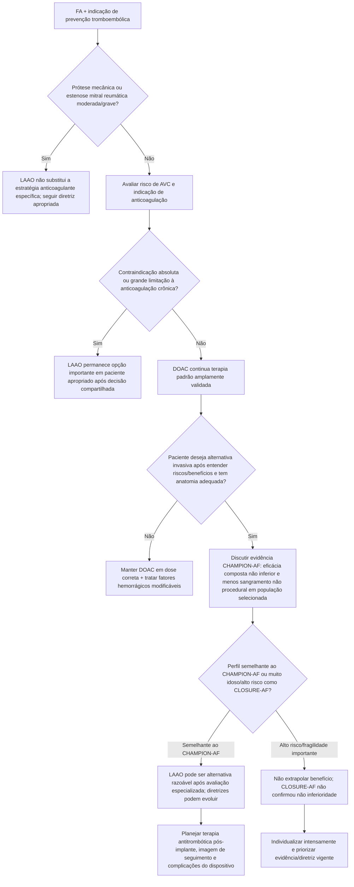

# Fechamento do apêndice atrial esquerdo em 2026

## Por que 2026 mudou a conversa

Até recentemente, a indicação mais consolidada de fechamento percutâneo do apêndice atrial esquerdo (LAAO) era o paciente com fibrilação atrial e risco tromboembólico relevante que **não podia manter anticoagulação oral de longo prazo** ou tinha razão clínica forte para buscar alternativa.

Em 2026, dois ensaios randomizados contemporâneos publicados no *New England Journal of Medicine* trouxeram mensagens complementares — e aparentemente discordantes se forem lidas superficialmente:

- **CHAMPION-AF:** comparou LAAO com DOAC em pacientes **aptos a anticoagulação**;
- **CLOSURE-AF:** comparou LAAO com melhor terapia médica em pacientes **mais idosos e com alto risco de AVC e sangramento**.

A leitura correta é que **população, comparador e desfecho importam**.

# CHAMPION-AF

## Desenho

- 3.000 pacientes randomizados;
- 1.499 para fechamento do apêndice;
- 1.501 para NOAC/DOAC;
- idade média 71,7 anos;
- 31,9% mulheres;
- CHA₂DS₂-VASc médio 3,5;
- pacientes considerados candidatos adequados à anticoagulação.

## Desfecho de eficácia em 3 anos

Composto de **morte cardiovascular, AVC ou embolia sistêmica**:

- LAAO: **5,7%**;
- anticoagulação: **4,8%**;
- diferença: **0,9 ponto percentual**;
- IC95% −0,8 a 2,6;
- **P<0,001 para não inferioridade**.

Portanto, o ensaio atingiu o objetivo de não inferioridade para o desfecho composto.

## Sangramento não relacionado ao procedimento

- LAAO: **10,9%**;
- anticoagulação: **19,0%**;
- HR **0,55**;
- IC95% 0,45–0,67;
- **P<0,001 para superioridade**.

Esse é o principal benefício demonstrado: menor sangramento não relacionado ao procedimento após a estratégia com dispositivo.

# CLOSURE-AF

## População diferente

O CLOSURE-AF incluiu pacientes com perfil mais frágil:

- 912 randomizados;
- idade média **77,9 anos**;
- CHA₂DS₂-VASc médio **5,2**;
- HAS-BLED médio **3,0**;
- alto risco simultâneo de AVC e sangramento.

O comparador era **melhor terapia médica definida pelo médico**, incluindo DOAC quando elegível.

## Resultado

O desfecho composto incluía:

- AVC;
- embolia sistêmica;
- sangramento maior;
- morte cardiovascular ou inexplicada.

Após mediana de 3 anos:

- LAAO: 155 primeiros eventos; **16,8 por 100 pacientes-ano**;
- terapia médica: 127 eventos; **13,3 por 100 pacientes-ano**;
- **P=0,44 para não inferioridade**.

O ensaio **não demonstrou não inferioridade** do fechamento do apêndice em relação ao tratamento médico.

# Como reconciliar os ensaios

Não é correto concluir:

> “CHAMPION-AF provou que todo paciente com FA pode trocar DOAC por dispositivo.”

Também não é correto concluir:

> “CLOSURE-AF provou que fechamento do apêndice não funciona.”

Os ensaios estudaram populações e estratégias diferentes. CHAMPION-AF demonstra que, numa população selecionada apta a DOAC, LAAO pode alcançar eficácia composta não inferior com menos sangramento tardio não relacionado ao procedimento. CLOSURE-AF mostra que isso **não pode ser automaticamente extrapolado** a uma população muito idosa, de risco extremo e comparada com manejo médico individualizado.

## Árvore de decisão clínica em 2026

# O procedimento tem riscos próprios

A comparação “sangramento com anticoagulante vs sem anticoagulante” é incompleta porque LAAO traz risco procedural e complicações específicas, como:

- derrame pericárdico/tamponamento;
- embolização do dispositivo;
- AVC peri-procedimento;
- trombo relacionado ao dispositivo;
- leak peridispositivo;
- necessidade de terapia antitrombótica temporária pós-implante.

Por isso, o benefício tardio de menos sangramento precisa ser ponderado contra o risco inicial do procedimento e a experiência do centro.

# E depois de ablação de FA?

O estudo OPTION, publicado anteriormente, demonstrou em pacientes submetidos a ablação que LAAO reduziu sangramento não relacionado ao procedimento e foi não inferior à anticoagulação para desfechos tromboembólicos compostos. Isso reforça o interesse na estratégia, mas é uma população específica e não elimina a necessidade de indicação individual.

# O que as diretrizes atuais ainda precisam incorporar

Os resultados do CHAMPION-AF são de 2026 e são posteriores às principais diretrizes de FA de 2023–2024. Portanto, qualquer expansão formal da indicação dependerá da atualização das sociedades e da análise de:

- subgrupos;
- eventos individuais, especialmente AVC isquêmico;
- complicações procedurais;
- terapia pós-implante;
- custo-efetividade;
- durabilidade e eventos além de 3 anos.

**Não transformar um resultado de não inferioridade em recomendação de primeira linha universal antes de atualização formal de diretriz.**

# Armadilhas

1. Não escolher LAAO só porque o paciente “não gosta” de tomar remédio sem discutir risco procedural.
2. Não chamar sangramento minor isolado de contraindicação absoluta a DOAC.
3. Não reduzir dose do DOAC empiricamente como alternativa ao LAAO.
4. Não extrapolar CHAMPION-AF para prótese mecânica/estenose mitral reumática.
5. Não ignorar CLOSURE-AF ao aconselhar idosos frágeis de altíssimo risco.
6. Não afirmar que LAAO é superior a DOAC para prevenção de AVC; CHAMPION-AF testou **não inferioridade do composto**, não superioridade de AVC isolado.

# Fontes verificadas

1. Doshi SK, Kar S, Nair DG, et al.; CHAMPION-AF Investigators. Left Atrial Appendage Closure or Anticoagulation for Atrial Fibrillation. *N Engl J Med.* 2026;394(21):2083-2094. PMID **41910347**. DOI **10.1056/NEJMoa2517213**.
2. Landmesser U, et al. Left Atrial Appendage Closure or Medical Therapy in Atrial Fibrillation. *N Engl J Med.* 2026;394:1270-1280. DOI **10.1056/NEJMoa2513310**.
3. Left Atrial Appendage Closure after Ablation for Atrial Fibrillation (OPTION). *N Engl J Med.* DOI **10.1056/NEJMoa2408308**.

# Status de revisão

`VERIFICAÇÃO HUMANA NECESSÁRIA`: antes de converter este documento em recomendação normativa da Corvia, aguardar/consultar a próxima atualização formal de diretriz de FA/LAAO e revisar os desfechos individuais e complicações procedurais completos do CHAMPION-AF e CLOSURE-AF.
