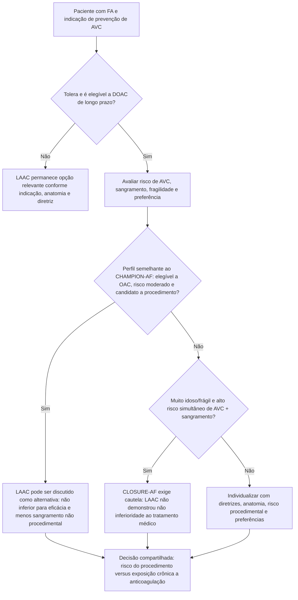

# CHAMPION-AF e CLOSURE-AF — por que dois ensaios de 2026 chegaram a mensagens diferentes?

Em março de 2026, dois grandes ensaios randomizados publicados no **New England Journal of Medicine** compararam fechamento percutâneo do apêndice atrial esquerdo (LAA closure/LAAC) com terapia anticoagulante/médica na fibrilação atrial. Os resultados precisam ser lidos juntos porque estudaram **populações diferentes** e usaram **desfechos diferentes**.

## CHAMPION-AF

### População

**3.000 pacientes** com FA que eram candidatos adequados a anticoagulação oral:

- 1.499 fechamento do apêndice;
- 1.501 NOAC;
- idade média 71,7 anos;
- CHA₂DS₂-VASc médio 3,5.

### Eficácia em 3 anos

Composto de morte cardiovascular, AVC ou embolia sistêmica:

- LAAC: **5,7%**;
- NOAC: **4,8%**;
- diferença absoluta **0,9 ponto percentual**;
- IC95% −0,8 a 2,6;
- **P<0,001 para não inferioridade**.

### Sangramento não relacionado ao procedimento

- LAAC: **10,9%**;
- NOAC: **19,0%**;
- HR **0,55**;
- IC95% 0,45–0,67;
- **P<0,001 para superioridade**.

Portanto, nessa população elegível a NOAC, LAAC foi não inferior no desfecho composto de eficácia e reduziu sangramento não procedimental.

## CLOSURE-AF

### População

Ensaio alemão com **912 pacientes** de risco substancialmente maior:

- idade média 77,9 anos;
- CHA₂DS₂-VASc médio **5,2**;
- HAS-BLED médio **3,0**;
- alto risco simultâneo de AVC e sangramento.

A análise primária incluiu 446 pacientes no dispositivo e 442 na terapia médica dirigida pelo médico, incluindo DOAC quando elegível.

### Desfecho primário

Composto de AVC, embolia sistêmica, sangramento maior ou morte cardiovascular/inexplicada:

- LAAC: **16,8 eventos/100 pacientes-ano**;
- tratamento médico: **13,3 eventos/100 pacientes-ano**.

A não inferioridade **não foi demonstrada**:

- diferença no restricted mean survival time: −0,36 ano;
- IC95% −0,70 a −0,01;
- **P=0,44 para não inferioridade**.

Eventos adversos graves ocorreram em 82,5% no grupo dispositivo e 77,4% no grupo médico.

## Por que os resultados não são contraditórios de forma simples

### Populações diferentes

CHAMPION-AF estudou pacientes considerados candidatos a anticoagulação. CLOSURE-AF recrutou população mais idosa e com **alto risco simultâneo de AVC e sangramento**, aproximando-se de um grupo mais frágil e complexo.

### Desfechos diferentes

CHAMPION-AF separou o desfecho de eficácia do sangramento não procedimental. CLOSURE-AF colocou **sangramento maior dentro do próprio composto primário**, juntamente com AVC, embolia e morte.

### Estratégias médicas diferentes

CHAMPION-AF comparou diretamente dispositivo com NOAC. CLOSURE-AF usou melhor terapia médica determinada pelo médico, com anticoagulação quando apropriada.

### Risco procedimental importa

LAAC troca parte do risco hemorrágico crônico de anticoagulação por um **risco inicial do procedimento/dispositivo**. Quanto mais frágil e multimórbido o paciente, mais esse risco procedimental pode pesar.

## Árvore de decisão — como usar os dois ensaios

## Como explicar ao paciente

Uma comunicação equilibrada pode ser:

> O fechamento do apêndice evita anticoagulação crônica em muitos pacientes, mas envolve um procedimento com riscos próprios. Em um grande estudo de pacientes aptos a usar anticoagulante, o dispositivo teve eficácia global não inferior e menos sangramento não procedimental. Em outro estudo com pacientes mais idosos e de maior risco, o dispositivo não conseguiu demonstrar resultado global tão bom quanto o tratamento médico. A escolha depende de qual população se parece mais com você.

## O que NÃO concluir

- Não afirmar que CHAMPION-AF provou que LAAC é superior a DOAC para prevenção de AVC isoladamente.
- Não afirmar que CLOSURE-AF provou que LAAC é sempre inferior.
- Não escolher dispositivo apenas pelo HAS-BLED alto sem considerar fragilidade e risco procedimental.
- Não omitir que o risco do dispositivo ocorre sobretudo no período procedimental, enquanto sangramento do DOAC é exposição contínua.
- Não usar um único dos dois ensaios para aconselhamento sem mencionar o outro em pacientes elegíveis a ambas as estratégias.

## Regra prática

**Depois de 2026, a pergunta deixou de ser simplesmente “Watchman ou anticoagulante?”. A pergunta correta é: este paciente se aproxima mais da população em que LAAC foi uma alternativa eficaz ao NOAC ou da população muito frágil em que o tratamento médico teve melhor desempenho global?**