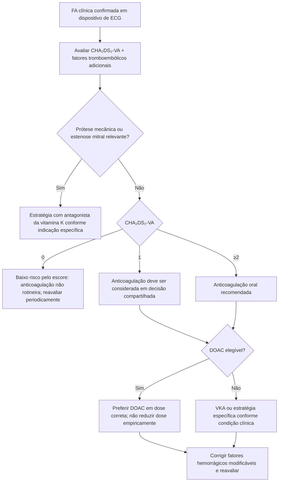
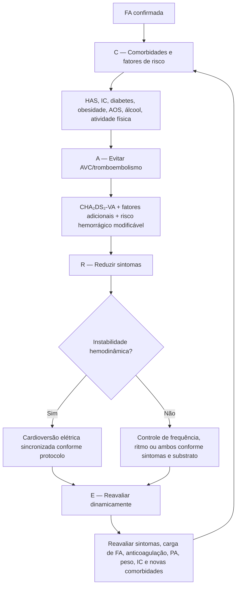

# Fibrilação atrial — ESC 2024

## A mudança de paradigma: AF-CARE

A diretriz ESC 2024 organiza o cuidado da fibrilação atrial no eixo **AF-CARE**:

- **C — Comorbidity and risk factor management:** tratar hipertensão, insuficiência cardíaca, diabetes, obesidade, apneia do sono, sedentarismo e consumo excessivo de álcool.
- **A — Avoid stroke and thromboembolism:** avaliar risco tromboembólico e indicar anticoagulação quando apropriado.
- **R — Reduce symptoms by rate and rhythm control:** controlar frequência e/ou ritmo de acordo com sintomas, substrato e objetivos do paciente.
- **E — Evaluation and dynamic reassessment:** reavaliar risco, sintomas, comorbidades e estratégia ao longo do tempo.

A mensagem prática é que FA não deve ser reduzida a "anticoagular e controlar a frequência". O cuidado é longitudinal e dinâmico.

## Mudança importante: CHA₂DS₂-VA

A ESC 2024 propõe, quando não há ferramenta local validada, o uso do **CHA₂DS₂-VA**, removendo sexo/gênero do escore.

| Componente | Pontos |
|---|---:|
| Insuficiência cardíaca | 1 |
| Hipertensão | 1 |
| Idade ≥75 anos | 2 |
| Diabetes | 1 |
| AVC/AIT/tromboembolismo arterial prévio | 2 |
| Doença vascular | 1 |
| Idade 65–74 anos | 1 |

A justificativa da ESC é que sexo feminino funciona como modificador dependente da idade e a inclusão de sexo/gênero complica a aplicação do escore.

## Árvore de decisão: anticoagulação pela ESC 2024

## Regras práticas que evitam erros

1. **Não suspender anticoagulação apenas porque o paciente está em ritmo sinusal.** O risco tromboembólico é determinado pelo perfil do paciente, não pelo ECG de uma consulta isolada.
2. **Não usar antiagregante como substituto da anticoagulação para prevenção de AVC na FA.**
3. **Não associar antiagregante + anticoagulante sem indicação vascular específica.**
4. **Não subdosar DOAC para “reduzir sangramento” sem preencher critério de redução da própria droga.**
5. Após ablação de FA, a ESC recomenda manter anticoagulação por **pelo menos 2 meses**, independentemente do risco estimado, e depois decidir manutenção pelo risco tromboembólico individual.

## Árvore AF-CARE integrada

## Controle de frequência: ponto de segurança

A ESC 2024 admite como opções iniciais:

- betabloqueador, independentemente da FEVE;
- digoxina, independentemente da FEVE;
- diltiazem/verapamil **apenas se FEVE >40%**.

A escolha deve integrar pressão arterial, função ventricular, atividade física, comorbidades e estratégia de ritmo.

## Controle de ritmo

A diretriz reforça que controle de ritmo deve ser considerado em pacientes adequados para redução de sintomas e morbidade. Em pacientes selecionados com FA recente e risco cardiovascular, uma estratégia de ritmo implementada precocemente pode ter benefício além do simples alívio sintomático.

A ablação por cateter pode ser considerada de primeira linha em FA paroxística em pacientes selecionados, e é opção importante após falha de antiarrítmico em FA persistente.

## Metas de fatores de risco citadas pela ESC 2024

- perda ponderal como parte do manejo de sobrepeso/obesidade, com alvo de **≥10% do peso corporal** em pacientes apropriados;
- atividade física aeróbica equivalente a **150–300 min/semana moderada** ou **75–150 min/semana vigorosa**;
- redução do álcool para **≤3 doses padrão/semana (≤30 g de álcool/semana)** para reduzir recorrência de FA.

## Armadilhas

- CHA₂DS₂-VA não elimina julgamento clínico; outros fatores tromboembólicos podem alterar a decisão.
- HAS-BLED elevado não é motivo isolado para negar anticoagulação; serve para identificar fatores modificáveis e necessidade de seguimento mais próximo.
- A presença de ritmo sinusal após cardioversão/ablação não “zera” risco de AVC.

## Fonte verificada

Van Gelder IC, Rienstra M, Bunting KV, et al. 2024 ESC Guidelines for the management of atrial fibrillation developed in collaboration with the European Association for Cardio-Thoracic Surgery (EACTS). *Eur Heart J.* 2024;45(36):3314-3414. PMID **39210723**. DOI **10.1093/eurheartj/ehae176**.

## Status de revisão

`VERIFICAÇÃO HUMANA NECESSÁRIA`: antes de converter trechos deste documento em itens formais de evidência, conferir diretamente a tabela de recomendações para classe e nível de evidência de cada frase individual.
