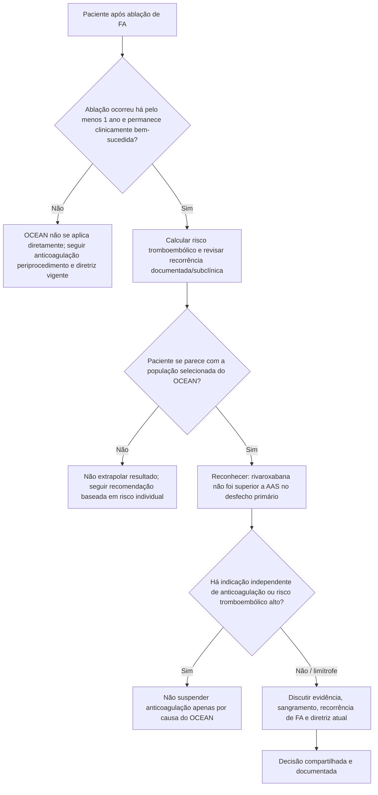

# OCEAN 2026 — antitrombótico após ablação bem-sucedida de FA

O **OCEAN** enfrentou uma pergunta clinicamente importante: após uma ablação aparentemente bem-sucedida de fibrilação atrial, pacientes com fatores de risco tromboembólico ainda se beneficiam de anticoagulação oral de longo prazo?

A resposta do ensaio deve ser interpretada com precisão. O estudo **não mostrou superioridade da rivaroxabana sobre aspirina** para seu desfecho primário, mas também não foi desenhado para provar que anticoagulação pode ser interrompida com segurança em qualquer paciente após ablação.

## Desenho

Ensaio internacional, aberto, randomizado e com avaliação cega de desfechos.

Foram incluídos **1.284 pacientes** que:

- haviam realizado ablação de FA com sucesso pelo menos **1 ano antes**;
- tinham CHA₂DS₂-VASc ≥1, com regras específicas adicionais para mulheres e para pacientes cujo único fator era doença vascular;
- foram randomizados para rivaroxabana ou aspirina;
- foram acompanhados por **3 anos**.

O desfecho primário combinou:

- AVC clínico;
- embolia sistêmica;
- novo AVC embólico silencioso em ressonância cerebral, definido no estudo como novo infarto ≥15 mm.

## Resultado primário

Eventos ocorreram em:

- **5 pacientes** no grupo rivaroxabana, equivalente a **0,31 evento por 100 pacientes-ano**;
- **9 pacientes** no grupo aspirina, **0,66 evento por 100 pacientes-ano**.

Efeito:

- **RR 0,56**;
- IC95% **0,19–1,65**;
- diferença absoluta em 3 anos **−0,6 ponto percentual**;
- IC95% −1,8 a 0,5;
- **P=0,28**.

Portanto, a rivaroxabana **não reduziu significativamente** o desfecho composto em comparação com aspirina.

## Segurança

Sangramento fatal ou maior ocorreu em:

- **1,6%** com rivaroxabana;
- **0,6%** com aspirina;
- HR **2,51**;
- IC95% **0,79–7,95**.

O intervalo de confiança é amplo e cruza 1. Esse resultado não permite afirmar aumento estatisticamente comprovado de sangramento, mas mostra que a escolha não é livre de trade-off hemorrágico.

## Pequenos infartos cerebrais na RM

Novos infartos <15 mm ocorreram em:

- **3,9%** dos pacientes avaliáveis com rivaroxabana;
- **4,4%** com aspirina;
- RR **0,89**; IC95% 0,51–1,55.

## Como conciliar o OCEAN com diretrizes

Diretrizes contemporâneas recomendam que a decisão de anticoagulação após ablação seja guiada principalmente pelo **risco tromboembólico basal**, e não apenas pelo aparente sucesso do procedimento.

O OCEAN fornece nova evidência randomizada em uma população selecionada, estável e distante pelo menos 1 ano da ablação. Ele **não valida a suspensão indiscriminada de anticoagulação em pacientes de alto risco** e não substitui automaticamente diretrizes vigentes.

A incorporação formal do estudo a recomendações futuras ainda precisa ser acompanhada.

## Árvore de aplicabilidade do OCEAN

## O que NÃO concluir

- **Não** concluir que aspirina é equivalente à anticoagulação em toda FA pós-ablação.
- **Não** concluir que a ablação elimina o risco embólico.
- **Não** aplicar diretamente a pacientes imediatamente após ablação: todos no OCEAN estavam pelo menos 1 ano além do procedimento.
- **Não** interpretar P=0,28 como prova de equivalência.
- **Não** interpretar o HR de sangramento como dano estatisticamente comprovado, pois o IC95% é amplo e inclui 1.
- **Não** usar o estudo isoladamente para contrariar uma indicação formal de anticoagulação por outra condição.

## Regra prática

**OCEAN muda a incerteza, não elimina a necessidade de estratificação individual.** Após ablação bem-sucedida e distante, o benefício absoluto da anticoagulação pode ser pequeno em alguns pacientes selecionados; a decisão continua dependente do risco tromboembólico, risco hemorrágico, recorrência de FA e recomendações atualizadas.