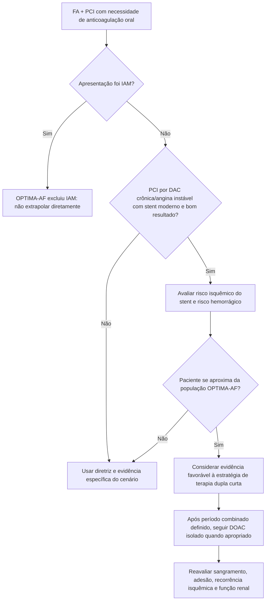

# OPTIMA-AF 2026

O **OPTIMA-AF** testou uma estratégia de redução precoce da terapia antitrombótica após PCI em pacientes com fibrilação atrial: **1 mês de DOAC + inibidor P2Y12**, seguido de DOAC isolado, versus **12 meses** de terapia dupla antes de passar para DOAC isolado.

## População

O ensaio foi conduzido em **75 centros no Japão**. A análise final incluiu **1.079 pacientes**:

- 542 no braço de 1 mês;
- 537 no braço de 12 meses.

Características que limitam a extrapolação:

- aproximadamente **94%** realizaram PCI por síndrome coronariana crônica;
- infarto agudo do miocárdio foi excluído;
- praticamente todos os procedimentos foram guiados por imagem intracoronária;
- população predominantemente japonesa e idosa.

## Eficácia

O desfecho primário de eficácia — morte ou eventos tromboembólicos — ocorreu em 12 meses em:

- **5,4%** no grupo de 1 mês;
- **4,5%** no grupo de 12 meses.

A estratégia curta atingiu o critério de **não inferioridade**:

- HR **1,20**;
- IC95% **0,70–2,07**;
- P=**0,002** para não inferioridade.

Não houve superioridade para eficácia (P=0,597).

## Sangramento

O desfecho de segurança — sangramento maior ou clinicamente relevante não maior — ocorreu em:

- **4,8%** no grupo de 1 mês;
- **9,5%** no grupo de 12 meses;
- HR **0,50**;
- IC95% **0,31–0,80**;
- P=**0,004** para superioridade.

A diferença foi impulsionada principalmente por redução de sangramento clinicamente relevante não maior. Sangramento maior isolado não apresentou diferença estatisticamente demonstrada.

## O que o estudo realmente sustenta

Em uma população selecionada com FA, predominantemente doença coronariana crônica e PCI moderna guiada por imagem, **encurtar para 1 mês o período de DOAC + P2Y12 reduziu sangramento sem demonstrar perda de eficácia dentro da margem de não inferioridade usada pelo estudo**.

Isso apoia a tendência contemporânea de reduzir exposição combinada a anticoagulante e antiagregante quando o risco isquêmico pós-PCI é suficientemente controlado.

## Árvore de aplicabilidade

## Armadilhas

- Aplicar 1 mês automaticamente a paciente com IAM: **IAM foi excluído**.
- Interpretar não inferioridade como equivalência absoluta entre estratégias.
- Ignorar que a margem de não inferioridade foi definida antes do estudo e os eventos foram menos frequentes do que o esperado.
- Extrapolar sem cautela de uma coorte japonesa para todas as populações.
- Suspender o DOAC após 1 mês: a estratégia testada suspendeu o **P2Y12**, mantendo anticoagulação.
- Confundir este ensaio com duração da DAPT em paciente sem indicação de anticoagulação.

## Regra prática

**OPTIMA-AF fortalece o conceito “menos é mais” na terapia combinada de FA + PCI, mas sobretudo em DAC crônica/angina instável e PCI moderna. Não autoriza encurtamento indiscriminado após IAM ou PCI de risco trombótico muito elevado.**