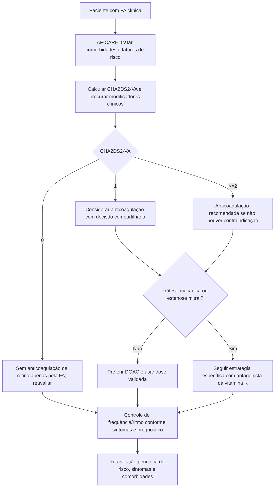

# ESC 2024 na fibrilação atrial — AF-CARE e anticoagulação pelo CHA₂DS₂-VA

A diretriz ESC 2024 reorganiza o cuidado da fibrilação atrial (FA) no eixo **AF-CARE**: **C**omorbidades e fatores de risco; **A**void stroke and thromboembolism; **R**educe symptoms por controle de frequência ou ritmo; **E**valuation e reavaliação dinâmica. A mensagem prática é que anticoagulação e estratégia de ritmo não devem ser decisões isoladas: o tratamento começa pelo fenótipo global do paciente e precisa ser reavaliado ao longo do tempo.

## 1. C — tratar o terreno em que a FA ocorre

Hipertensão, insuficiência cardíaca, diabetes, obesidade, apneia obstrutiva do sono, sedentarismo e consumo excessivo de álcool devem ser procurados e tratados ativamente. Essa etapa não é acessória: ela integra o tratamento da própria FA e influencia sintomas, recorrência e risco cardiovascular.

## 2. A — prevenir AVC e tromboembolismo

A ESC 2024 propõe o **CHA₂DS₂-VA**, removendo sexo feminino do escore usado para apoiar a decisão de anticoagulação. O racional é que sexo feminino funciona como modificador de risco dependente de idade e de outros fatores, e não como fator isolado que deva criar limiares diferentes para homens e mulheres.

### Componentes do CHA₂DS₂-VA

- **C** — insuficiência cardíaca clínica ou FEVE assintomática ≤40%: 1 ponto;
- **H** — hipertensão arterial: 1 ponto;
- **A₂** — idade ≥75 anos: 2 pontos;
- **D** — diabetes mellitus: 1 ponto;
- **S₂** — AVC, AIT ou tromboembolismo arterial prévios: 2 pontos;
- **V** — doença vascular: 1 ponto;
- **A** — idade 65–74 anos: 1 ponto.

### Limiar operacional da ESC 2024

- **CHA₂DS₂-VA = 0:** em geral, baixo risco tromboembólico; anticoagulação de rotina não é indicada apenas pela presença de FA;
- **CHA₂DS₂-VA = 1:** anticoagulação oral **deve ser considerada**, após avaliação individual e decisão compartilhada;
- **CHA₂DS₂-VA ≥2:** anticoagulação oral **é recomendada**, salvo contraindicação clínica relevante.

O escore é ferramenta de apoio, não substituto do julgamento clínico. Fatores tromboembólicos não capturados pelo escore podem modificar a decisão, e o risco deve ser reavaliado periodicamente.

## 3. Qual anticoagulante?

Quando a anticoagulação está indicada, a diretriz prefere **DOAC** a antagonista da vitamina K para a maioria dos pacientes com FA. As exceções centrais são **prótese valvar mecânica** e **estenose mitral**, contextos em que essa preferência não se aplica.

A dose do DOAC deve seguir os critérios específicos de redução de dose de cada fármaco. **Reduzir empiricamente a dose apenas por receio de sangramento, sem preencher os critérios validados, não é uma estratégia de segurança.**

Para antagonistas da vitamina K, a diretriz mantém como referência geral **INR 2,0–3,0**, buscando tempo em faixa terapêutica superior a 70%.

## 4. O que não usar para prevenir AVC na FA

Antiagregação isolada com AAS, ou AAS associado a clopidogrel, **não substitui anticoagulação** para prevenção de AVC tromboembólico na FA quando há indicação de anticoagulante.

Da mesma forma, escores de risco hemorrágico não devem ser usados isoladamente para negar ou retirar anticoagulação. O uso correto é identificar e corrigir fatores de sangramento modificáveis — por exemplo, hipertensão não controlada, uso concomitante desnecessário de antiagregante/AINE, abuso de álcool e controle inadequado do INR.

## 5. R — reduzir sintomas e, em pacientes selecionados, melhorar prognóstico

Controle de frequência e controle de ritmo são ferramentas complementares. A diretriz 2024 dá maior ênfase à estratégia de ritmo e à ablação por cateter em pacientes apropriados, mas a escolha deve considerar sintomas, duração da FA, substrato atrial, comorbidades, probabilidade de manutenção do ritmo sinusal, riscos do procedimento e preferência do paciente.

Um ponto essencial: **restaurar ritmo sinusal não elimina automaticamente a indicação de anticoagulação**. A prevenção tromboembólica continua guiada pelo risco individual, não apenas pela presença aparente de ritmo sinusal em uma consulta.

## 6. E — reavaliar dinamicamente

FA e risco cardiovascular mudam. Um paciente inicialmente CHA₂DS₂-VA 0 pode desenvolver hipertensão, diabetes, doença vascular ou simplesmente mudar de faixa etária. Portanto, a decisão de anticoagulação, controle de sintomas, fatores de risco e estratégia de ritmo deve ser reavaliada periodicamente.

## Árvore prática

## Armadilhas de segurança

- Somar um ponto apenas por sexo feminino e usar limiares diferentes de anticoagulação, contrariando o CHA₂DS₂-VA proposto pela ESC 2024.
- Prescrever AAS como substituto de anticoagulante para prevenção de AVC na FA.
- Subdosar DOAC sem critério formal de redução.
- Suspender anticoagulação porque o paciente está em ritmo sinusal após cardioversão ou ablação, sem reavaliar o risco tromboembólico.
- Usar HAS-BLED ou outro escore hemorrágico como veto automático à anticoagulação, em vez de corrigir fatores modificáveis.

## Referência principal

Van Gelder IC, Rienstra M, Bunting KV, et al. *2024 ESC Guidelines for the management of atrial fibrillation developed in collaboration with the European Association for Cardio-Thoracic Surgery (EACTS).* Eur Heart J. 2024;45(36):3314-3414. DOI **10.1093/eurheartj/ehae176**. PMID **39210723**.
