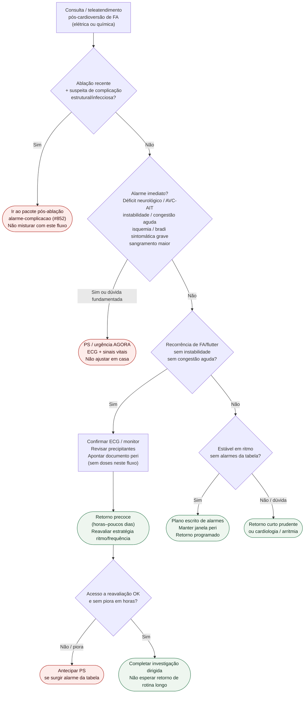

# Fluxograma ambulatorial: pós-cardioversão de FA — destino

Prosa: [`sinalizadores-ambulatoriais-pos-cardioversao-fa-quando-voltar-ao-ps`](sinalizadores-ambulatoriais-pos-cardioversao-fa-quando-voltar-ao-ps.md). Recorrência leve: [`recorrencia-leve-pos-cardioversao-fa-retorno-precoce-nao-ps`](recorrencia-leve-pos-cardioversao-fa-retorno-precoce-nao-ps.md). Peri anticoag (não este): [`fluxograma-cardioversao-eletiva-anticoagulacao-periprocedimento`](fluxograma-cardioversao-eletiva-anticoagulacao-periprocedimento.md).

## Árvore de decisão

## Notas

- **D1** = gate de segurança pós-cardioversão (neurológico / hemodinâmico / congestivo / isquêmico / bradi grave).
- **D2** = recorrência estável → retorno precoce, não “alta sem plano”.
- **D0** = desvia complicação pós-ablação para o pacote #852.
- **Não decide** anticoagulação peri, doses, bridge nem CHA₂DS₂-VA.
