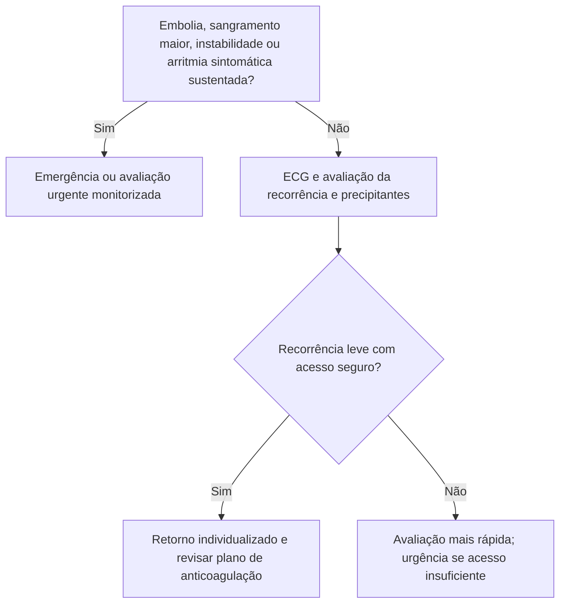

# Fluxograma ambulatorial: pós-cardioversão de FA — PS agora vs retorno precoce vs plano

Consulte o protocolo de sinalizadores do mesmo pacote para critérios e limites. Reavalie o destino após exames e diante de qualquer piora.

## Navegação

- [`sinalizadores-ambulatoriais-pos-cardioversao-fa-quando-voltar-ao-ps`](/biblioteca/sinalizadores-ambulatoriais-pos-cardioversao-fa-quando-voltar-ao-ps)
- [`recorrencia-leve-pos-cardioversao-fa-retorno-precoce-nao-ps`](/biblioteca/recorrencia-leve-pos-cardioversao-fa-retorno-precoce-nao-ps)
- [`fluxograma-cardioversao-eletiva-anticoagulacao-periprocedimento`](/biblioteca/fluxograma-cardioversao-eletiva-anticoagulacao-periprocedimento)
