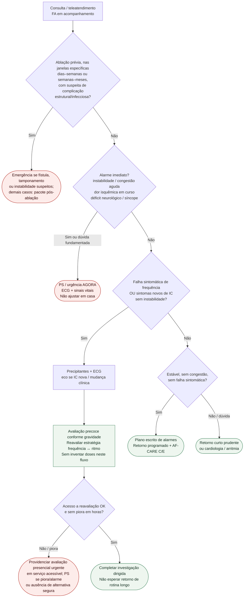

# Fluxograma ambulatorial: sinalizadores na FA (não-anticoag) — destino

Prosa: [sinalizadores-ambulatoriais-falha-controle-frequencia-e-novos-sintomas-de-ic-na-fa](/biblioteca/sinalizadores-ambulatoriais-falha-controle-frequencia-e-novos-sintomas-de-ic-na-fa). Pós-ablação (complicação): [sinalizadores-ambulatoriais-pos-ablacao-fa-alarme-complicacao-nao-recorrencia](/biblioteca/sinalizadores-ambulatoriais-pos-ablacao-fa-alarme-complicacao-nao-recorrencia). Controle de frequência (droga/alvo): [fluxograma-controle-de-frequencia-na-fa-escolha-da-droga-por-feve-e-alvo-esc-2024](/biblioteca/fluxograma-controle-de-frequencia-na-fa-escolha-da-droga-por-feve-e-alvo-esc-2024).

## Árvore de decisão

## Notas

- **D1** = gate de segurança (instabilidade / congestão aguda / isquemia / déficit).
- **D2** = falha de frequência sintomática ou IC nova ambulatorial → retorno precoce + reavaliar estratégia (ESC AF-CARE R/E; SBC 2025).
- **D0** = desvia complicação pós-ablação para o pacote dedicado (não misturar com recorrência/blanking).
- **Não decide** anticoagulação, doses, bridge nem CHA₂DS₂-VA.

## Salvaguardas de complicações e destino

Suspeita de fístula atrioesofágica exige emergência e comunicação explícita de ablação de FA e data. Evitar endoscopia, ETE ou instrumentação esofágica não planejada até avaliação especializada, pelo risco de embolia aérea. Não exigir tríade completa. Tamponamento, déficit neurológico e insuficiência respiratória são emergências. Estenose de veia pulmonar e lesão frênica estáveis pedem investigação especializada prioritária, não PS automático.

Frequência elevada isolada não define emergência. IC nova pede ecocardiograma e investigação de cardiomiopatia induzida por taquicardia, valvopatia, isquemia e outras causas; não presumir falha de frequência. Recorrência precoce isolada não equivale a falha da ablação. Sucesso aparente de ritmo não autoriza interromper anticoagulação prescrita pelo risco.
