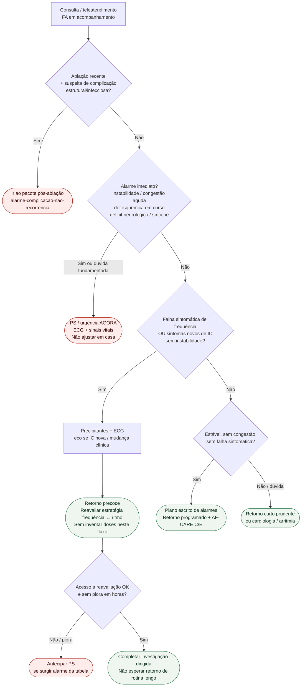

# Fluxograma ambulatorial: sinalizadores na FA (não-anticoag) — destino

Prosa: [`sinalizadores-ambulatoriais-falha-controle-frequencia-e-novos-sintomas-de-ic-na-fa`](sinalizadores-ambulatoriais-falha-controle-frequencia-e-novos-sintomas-de-ic-na-fa.md). Pós-ablação (complicação): [`sinalizadores-ambulatoriais-pos-ablacao-fa-alarme-complicacao-nao-recorrencia`](sinalizadores-ambulatoriais-pos-ablacao-fa-alarme-complicacao-nao-recorrencia.md). Controle de frequência (droga/alvo): [`fluxograma-controle-de-frequencia-na-fa-escolha-da-droga-por-feve-e-alvo-esc-2024`](fluxograma-controle-de-frequencia-na-fa-escolha-da-droga-por-feve-e-alvo-esc-2024.md).

## Árvore de decisão

## Notas

- **D1** = gate de segurança (instabilidade / congestão aguda / isquemia / déficit).
- **D2** = falha de frequência sintomática ou IC nova ambulatorial → retorno precoce + reavaliar estratégia (ESC AF-CARE R/E; SBC 2025).
- **D0** = desvia complicação pós-ablação para o pacote dedicado (não misturar com recorrência/blanking).
- **Não decide** anticoagulação, doses, bridge nem CHA₂DS₂-VA.
