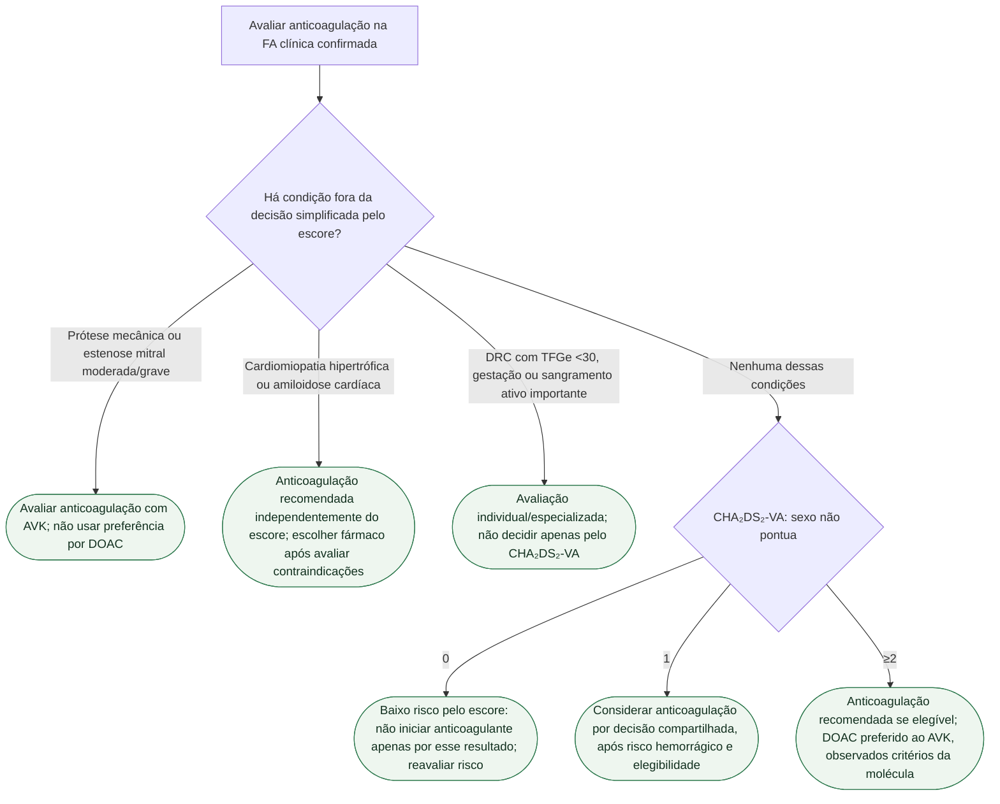

# Fluxograma: anticoagulação pelo CHA₂DS₂-VA — ESC 2024

Este fluxo aplica-se à FA clínica confirmada e exige avaliação das exceções antes do escore. Alerta isolado de wearable não estabelece diagnóstico. Episódios subclínicos confirmados têm indicação própria e não devem ser descartados automaticamente por falta de ECG de superfície.

## Aplicação e classes

A anticoagulação na FA clínica com risco embólico elevado é I A; CHA₂DS₂-VA ≥2 como indicador desse risco é I C, e escore 1 para considerar anticoagulação é IIa C. Não atribuir o nível do escore automaticamente ao tratamento.

IC, hipertensão, diabetes, doença vascular e idade 65–74: 1 ponto cada. Idade ≥75 e AVC/AIT/embolia arterial prévios: 2 pontos cada. Idade 65–74 e ≥75 não se somam. Mulher de 66 anos com hipertensão tem escore 2: o sexo sai, mas a indicação permanece.

Antes de usar apenas o escore, identificar exceções: FA com cardiomiopatia hipertrófica ou amiloidose cardíaca tem indicação de anticoagulação independentemente do CHA₂DS₂-VA (ESC FA 2024, I B). Prótese mecânica ou estenose mitral moderada/grave exigem estratégia com AVK, não DOAC. Na DRC com TFGe <30 mL/min/1,73 m², a ESC DRC 2026 não recomenda escores clínicos de risco embólico para decidir anticoagulação; individualizar benefício/risco e tratamento. Episódios subclínicos confirmados por dispositivo têm avaliação própria (DOAC pode ser considerado em alto risco embólico sem alto risco hemorrágico, IIb B), distinta de alerta isolado de wearable sem confirmação.

Na DRC com TFGe ≥30, preferência por DOAC é I A na ESC DRC 2026. TFGe 15–29: inibidores de fator Xa podem ser considerados (IIa B1), com escolha e dose específicas. Não reduzir dose de DOAC apenas por receio de sangramento sem cumprir critérios da molécula. AF-CARE e reavaliação periódica valem em todos os ramos.

## Tudo com Tudo

Fibrilação atrial · Tromboembolismo · Cardiorrenal · Farmacologia · Insuficiência cardíaca · Hipertensão · Comunicação clínica · Cardiomiopatias · Valvopatias.
