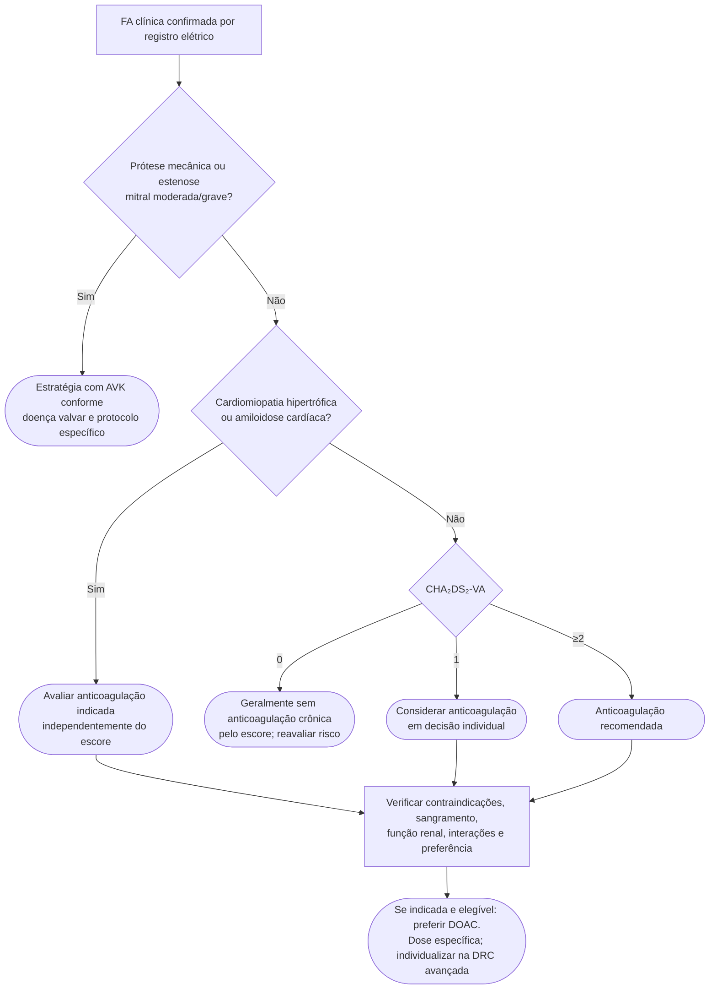

# Fluxograma: anticoagulação pelo CHA₂DS₂-VA — ESC 2024

Aplicável à avaliação de prevenção tromboembólica de longo prazo na FA clínica. Gestação, cardioversão, prótese mecânica, estenose mitral moderada/grave e FA subclínica detectada por dispositivo exigem avaliação específica. Um alerta de pulso irregular sem confirmação elétrica não basta para diagnosticar FA.

A idade ≥75 e o antecedente de AVC/AIT/tromboembolismo arterial valem dois pontos cada. IC, hipertensão, diabetes, doença vascular e idade 65–74 valem um cada; sexo não pontua e faixas etárias não se somam. Mulher de 66 anos com hipertensão tem escore 2.

A avaliação hemorrágica identifica fatores corrigíveis; não deve ser usada isoladamente para negar anticoagulação indicada. Não reduzir dose de DOAC sem critérios próprios da molécula. A função renal deve ser calculada pelo método exigido pela bula. Na DRC avançada/diálise, o escore tem limitações e a decisão precisa considerar benefício, risco e equipe especializada.

AF-CARE permanece em todos os ramos: comorbidades, prevenção de AVC, sintomas e reavaliação. Fonte: [ESC FA 2024](https://doi.org/10.1093/eurheartj/ehae176).

## Tudo com Tudo

- [CHA₂DS₂-VA: o sexo saiu do escore — ESC 2024 de FA](/biblioteca/cha2ds2-va-esc-2024-sexo-saiu-do-escore)
- [ESC 2026: IC e FA — o que muda na ficha conjunta](/biblioteca/esc-2026-ic-e-fa-o-que-muda-na-ficha-conjunta)
- [Estabilizador vs silenciador na ATTR-CM](/biblioteca/estabilizador-vs-silenciador-na-attr-cm)
