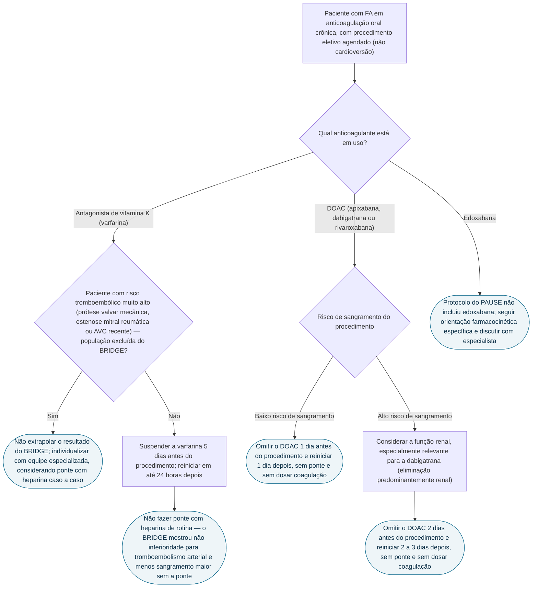

# Fluxograma: anticoagulação periprocedimento na FA para procedimento eletivo — BRIDGE e PAUSE

Esta é a pergunta de consultório mais frequente na FA anticoagulada: o paciente vai fazer uma cirurgia ou procedimento eletivo qualquer — extração dentária, colonoscopia, cirurgia de catarata, herniorrafia — e não uma cardioversão ou ablação. Durante anos, a resposta padrão era "ponte com heparina, por segurança". O BRIDGE (varfarina) e o PAUSE (DOAC) mostraram que essa prática causa dano sem entregar proteção, e que a interrupção pode seguir um protocolo simples baseado em dias, não em exame de coagulação.

## Árvore de decisão

## O que a árvore não mostra

**Os números do BRIDGE**: tromboembolismo arterial em 0,4% sem ponte contra 0,3% com ponte (não inferioridade, p=0,01), e sangramento maior em 1,3% sem ponte contra 3,2% com ponte (risco relativo 0,41; p=0,005 para superioridade) — a ponte estava tentando prevenir um evento raro ao custo de triplicar o sangramento maior.

**Os números do PAUSE**, coorte de 3.007 pacientes com FA em apixabana, dabigatrana ou rivaroxabana: sangramento maior em 30 dias variou de 0,90% (dabigatrana) a 1,85% (rivaroxabana), e tromboembolismo arterial de 0,16% a 0,60% — nenhuma dosagem de coagulação foi usada para liberar o procedimento.

**Ambos os estudos são de procedimento eletivo** — nada nesta árvore se aplica a cirurgia de urgência, cenário em que a discussão é de reversão do anticoagulante, não de suspensão programada. **O BRIDGE é randomizado, duplo-cego**; **o PAUSE é coorte prospectiva, sem braço comparador** — demonstra segurança da estratégia, não superioridade sobre outra. **Em qualquer ramo, a retomada do anticoagulante no prazo definido faz parte do protocolo** — interromper sem plano de reinício é o outro lado do mesmo erro.